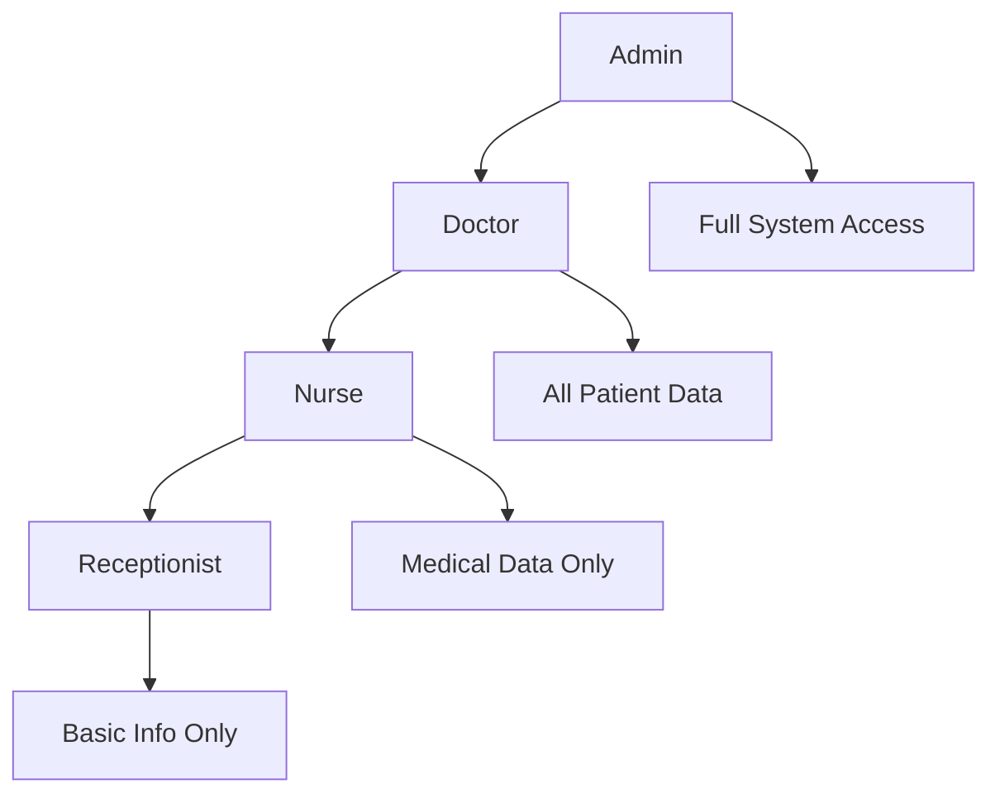

# HIPAA Compliance

The Health Insurance Portability and Accountability Act (HIPAA) sets the standard for protecting sensitive patient data. SecureHealth is designed to meet and exceed HIPAA requirements through comprehensive security measures and MongoDB Queryable Encryption.

## HIPAA Requirements Overview

### Administrative Safeguards
- **Security Officer**: Designated individual responsible for security
- **Workforce Training**: Regular security awareness training
- **Access Management**: Procedures for granting and revoking access
- **Information Access Management**: Policies for data access
- **Security Awareness**: Ongoing security education programs

### Physical Safeguards
- **Facility Access Controls**: Physical security measures
- **Workstation Use**: Policies for workstation security
- **Device and Media Controls**: Management of devices and media
- **Workstation Security**: Physical protection of workstations

### Technical Safeguards
- **Access Control**: Unique user identification and access management
- **Audit Controls**: Hardware, software, and procedural mechanisms
- **Integrity**: Protection against improper alteration or destruction
- **Transmission Security**: Protection against unauthorized access during transmission

## How SecureHealth Meets HIPAA Requirements

### 1. Access Control (164.312(a))

**Requirement**: Implement technical policies and procedures for electronic information systems that maintain electronic protected health information (ePHI) to allow access only to those persons or software programs that have been granted access rights.

**SecureHealth Implementation**:
- **Unique User Identification**: Each user has a unique username and password
- **Role-Based Access Control**: Three-tier system (Doctor, Nurse, Receptionist)
- **Automatic Logoff**: Sessions automatically expire after inactivity
- **Encryption**: All ePHI encrypted at rest using AES-256

```php
// Example: Role-based access control implementation
class PatientController extends AbstractController
{
    #[Route('/patient/{id}', methods: ['GET'])]
    public function viewPatient(string $id): JsonResponse
    {
        $user = $this->getUser();
        $patient = $this->patientRepository->find($id);
        
        // Check if user has permission to view this patient
        if (!$this->isGranted('VIEW', $patient)) {
            throw new AccessDeniedException('Insufficient permissions');
        }
        
        // Return data filtered by user role
        return $this->json($patient->toArray($user));
    }
}
```

### 2. Audit Controls (164.312(b))

**Requirement**: Implement hardware, software, and/or procedural mechanisms that record and examine activity in information systems that contain or use ePHI.

**SecureHealth Implementation**:
- **Comprehensive Logging**: All access to ePHI is logged
- **Audit Trail**: Complete history of data access and modifications
- **Real-time Monitoring**: Continuous monitoring of system activity
- **Compliance Reporting**: Automated reports for compliance audits

```php
// Example: Audit logging implementation
class AuditLogger
{
    public function logAccess(User $user, string $action, $resource): void
    {
        $auditLog = new AuditLog();
        $auditLog->setUser($user);
        $auditLog->setAction($action);
        $auditLog->setResource($resource);
        $auditLog->setTimestamp(new DateTime());
        $auditLog->setIpAddress($this->getClientIp());
        $auditLog->setUserAgent($this->getUserAgent());
        
        $this->auditRepository->save($auditLog);
    }
}
```

### 3. Integrity (164.312(c))

**Requirement**: Implement policies and procedures to protect ePHI from improper alteration or destruction.

**SecureHealth Implementation**:
- **Data Encryption**: All ePHI encrypted using MongoDB Queryable Encryption
- **Checksums**: Data integrity verification
- **Version Control**: Track all data modifications
- **Backup Procedures**: Regular encrypted backups

### 4. Transmission Security (164.312(e))

**Requirement**: Implement technical security measures to guard against unauthorized access to ePHI that is being transmitted over an electronic communications network.

**SecureHealth Implementation**:
- **HTTPS/TLS**: All data transmission encrypted
- **API Security**: Secure REST API endpoints
- **Authentication**: JWT-based authentication
- **Rate Limiting**: Protection against brute force attacks

## MongoDB Queryable Encryption for HIPAA Compliance

### Encryption Types and Use Cases

#### Deterministic Encryption (D)
**Use Case**: Searchable fields like patient names, IDs
**HIPAA Benefit**: Enables secure searching while maintaining encryption
**Example**: Patient name searches for appointment scheduling

```javascript
// MongoDB Queryable Encryption configuration
{
  "firstName": {
    "algorithm": "AEAD_AES_256_CBC_HMAC_SHA_512-Deterministic",
    "keyId": "patient-name-key"
  }
}
```

#### Range Encryption (R)
**Use Case**: Date ranges, numeric queries
**HIPAA Benefit**: Enables secure range queries for reporting
**Example**: Finding patients by date of birth or appointment dates

```javascript
{
  "dateOfBirth": {
    "algorithm": "AEAD_AES_256_CBC_HMAC_SHA_512-Random",
    "range": {
      "min": 0,
      "max": 100,
      "sparsity": 1
    }
  }
}
```

#### Standard Encryption (S)
**Use Case**: Highly sensitive data
**HIPAA Benefit**: Maximum security for most sensitive information
**Example**: Social Security Numbers, detailed medical notes

```javascript
{
  "ssn": {
    "algorithm": "AEAD_AES_256_CBC_HMAC_SHA_512-Random",
    "keyId": "ssn-key"
  }
}
```

## Role-Based Access Control Implementation

### Healthcare Role Hierarchy



### Permission Matrix

| Data Type | Admin | Doctor | Nurse | Receptionist |
|-----------|-------|--------|-------|--------------|
| Patient Demographics | ✅ | ✅ | ✅ | ✅ |
| Medical History | ✅ | ✅ | ✅ | ❌ |
| Lab Results | ✅ | ✅ | ✅ | ❌ |
| Prescriptions | ✅ | ✅ | ✅ | ❌ |
| Insurance Info | ✅ | ✅ | ❌ | ✅ |
| Appointment Notes | ✅ | ✅ | ✅ | ✅ |
| Audit Logs | ✅ | ✅ | ❌ | ❌ |

## Audit Logging Implementation

### Comprehensive Audit Trail

Every action in SecureHealth is logged with:

- **User Identity**: Who performed the action
- **Action Type**: What was done (view, create, update, delete)
- **Resource**: What data was accessed
- **Timestamp**: When the action occurred
- **IP Address**: Where the action originated
- **User Agent**: Browser/client information
- **Result**: Success or failure status

### Audit Log Example

```json
{
  "id": "audit_12345",
  "timestamp": "2024-01-15T10:30:00Z",
  "user": {
    "id": "user_456",
    "email": "doctor@securehealth.dev",
    "role": "ROLE_DOCTOR"
  },
  "action": "VIEW_PATIENT",
  "resource": {
    "type": "Patient",
    "id": "patient_789",
    "fields": ["firstName", "lastName", "medicalHistory"]
  },
  "ipAddress": "192.168.1.100",
  "userAgent": "Mozilla/5.0...",
  "result": "SUCCESS",
  "compliance": {
    "hipaaCompliant": true,
    "auditRequired": true
  }
}
```

## Compliance Reporting

### Automated Reports

SecureHealth generates automated compliance reports:

- **Access Reports**: Who accessed what data and when
- **Security Incidents**: Failed login attempts, unauthorized access
- **Data Breach Reports**: Potential security incidents
- **Audit Summaries**: Monthly and quarterly compliance summaries

### Manual Audit Capabilities

- **Real-time Monitoring**: Live view of system activity
- **Custom Queries**: Search audit logs by various criteria
- **Export Functions**: Export audit data for external analysis
- **Alert System**: Notifications for suspicious activity

## Security Best Practices

### 1. Key Management

- **Key Rotation**: Regular encryption key rotation
- **Key Separation**: Different keys for different data types
- **Secure Storage**: Keys stored in MongoDB Atlas Key Vault
- **Access Control**: Limited key access to authorized personnel

### 2. User Management

- **Strong Authentication**: Multi-factor authentication support
- **Password Policies**: Enforced password complexity
- **Session Management**: Automatic session timeout
- **Access Reviews**: Regular access permission reviews

### 3. Data Protection

- **Encryption at Rest**: All ePHI encrypted in database
- **Encryption in Transit**: HTTPS/TLS for all communications
- **Data Minimization**: Only necessary data is collected
- **Retention Policies**: Automated data retention and deletion

## Compliance Checklist

### Technical Safeguards
- [ ] Unique user identification implemented
- [ ] Role-based access control configured
- [ ] Automatic logoff enabled
- [ ] Encryption at rest implemented
- [ ] Audit logging active
- [ ] Data integrity controls in place
- [ ] Transmission security configured

### Administrative Safeguards
- [ ] Security officer designated
- [ ] Workforce training completed
- [ ] Access management procedures documented
- [ ] Incident response plan established
- [ ] Regular security assessments scheduled

### Physical Safeguards
- [ ] Facility access controls implemented
- [ ] Workstation security policies established
- [ ] Device and media controls documented
- [ ] Physical security measures in place

## Monitoring and Alerting

### Security Monitoring

- **Failed Login Attempts**: Alert after multiple failures
- **Unusual Access Patterns**: Detect anomalous behavior
- **Data Export Activities**: Monitor bulk data access
- **Privilege Escalation**: Alert on permission changes

### Compliance Monitoring

- **Audit Log Completeness**: Ensure all actions are logged
- **Data Access Patterns**: Monitor for compliance violations
- **Encryption Status**: Verify encryption is active
- **Backup Verification**: Confirm backup procedures

## Incident Response

### Security Incident Procedures

1. **Detection**: Automated monitoring detects potential incidents
2. **Assessment**: Security team evaluates the incident
3. **Containment**: Immediate steps to prevent further damage
4. **Investigation**: Detailed analysis of the incident
5. **Recovery**: Restore normal operations
6. **Documentation**: Complete incident documentation
7. **Review**: Post-incident review and improvements

### Breach Notification

- **Immediate Response**: Notify security team within 1 hour
- **Assessment**: Determine if breach occurred within 24 hours
- **Notification**: Notify affected parties within 72 hours
- **Regulatory Reporting**: File required reports within 60 days

## Next Steps

- **[Queryable Encryption Concepts](/docs/concepts/queryable-encryption)** - Learn about MongoDB encryption
- **[Role-Based Access Control](/docs/concepts/role-based-access)** - Understand access management
- **[Audit Logging](/docs/concepts/audit-logging)** - Explore compliance logging
- **[Security Architecture](/docs/concepts/security-architecture)** - Overall security design
