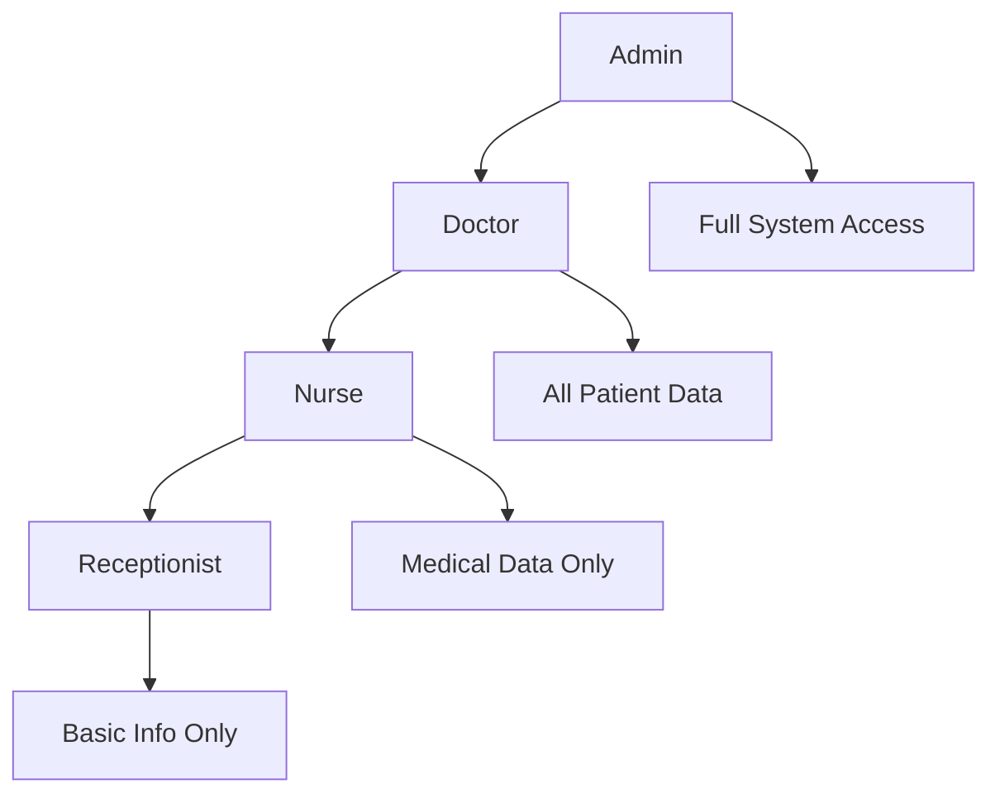

# Role-Based Access Control

Role-Based Access Control (RBAC) is a fundamental security principle in healthcare applications. SecureHealth implements a comprehensive RBAC system that ensures users can only access the data necessary for their job functions, maintaining HIPAA compliance and patient privacy.

## Healthcare Role Hierarchy

SecureHealth implements a three-tier role system designed specifically for healthcare environments:



### Role Definitions

#### Admin Role
- **Full System Access**: Complete administrative control
- **User Management**: Create, modify, and delete user accounts
- **System Configuration**: Configure encryption, audit settings
- **Audit Log Access**: View all audit logs and compliance reports
- **Backup Management**: Manage data backups and recovery

#### Doctor Role
- **Full Patient Access**: Complete access to all patient data
- **Medical Records**: View and edit medical history, diagnoses, treatments
- **Clinical Decision Support**: Access to medical knowledge base
- **Drug Interaction Checking**: Full access to medication databases
- **Appointment Management**: Schedule and manage patient appointments
- **Staff Communication**: Communicate with nurses and other staff

#### Nurse Role
- **Medical Data Access**: Access to patient medical information
- **Patient Care Coordination**: Manage patient care plans
- **Medication Administration**: Record medication administration
- **Limited Personal Data**: Access to necessary patient demographics
- **Doctor Communication**: Communicate with doctors about patient care
- **Care Documentation**: Document patient care activities

#### Receptionist Role
- **Basic Patient Information**: Access to patient contact information
- **Appointment Scheduling**: Manage appointment calendar
- **Insurance Management**: Handle insurance information
- **Patient Registration**: Register new patients
- **Limited Medical Access**: No access to medical records or history

## Permission Matrix

| Data Type | Admin | Doctor | Nurse | Receptionist |
|-----------|-------|--------|-------|--------------|
| **Patient Demographics** | ✅ | ✅ | ✅ | ✅ |
| - Name, DOB, Contact Info | ✅ | ✅ | ✅ | ✅ |
| - Address, Phone, Email | ✅ | ✅ | ✅ | ✅ |
| **Medical History** | ✅ | ✅ | ✅ | ❌ |
| - Diagnoses, Treatments | ✅ | ✅ | ✅ | ❌ |
| - Medical Notes | ✅ | ✅ | ✅ | ❌ |
| **Lab Results** | ✅ | ✅ | ✅ | ❌ |
| - Blood Tests, Imaging | ✅ | ✅ | ✅ | ❌ |
| - Pathology Reports | ✅ | ✅ | ✅ | ❌ |
| **Prescriptions** | ✅ | ✅ | ✅ | ❌ |
| - Current Medications | ✅ | ✅ | ✅ | ❌ |
| - Medication History | ✅ | ✅ | ✅ | ❌ |
| **Insurance Information** | ✅ | ✅ | ❌ | ✅ |
| - Policy Numbers | ✅ | ✅ | ❌ | ✅ |
| - Coverage Details | ✅ | ✅ | ❌ | ✅ |
| **Appointment Information** | ✅ | ✅ | ✅ | ✅ |
| - Schedule, Times | ✅ | ✅ | ✅ | ✅ |
| - Appointment Notes | ✅ | ✅ | ✅ | ✅ |
| **Audit Logs** | ✅ | ✅ | ❌ | ❌ |
| - Access Logs | ✅ | ✅ | ❌ | ❌ |
| - Compliance Reports | ✅ | ✅ | ❌ | ❌ |

## Implementation Architecture

### Symfony Security Voter Pattern

SecureHealth uses Symfony's Security Voter pattern to implement fine-grained access control:

```php
<?php

namespace App\Security\Voter;

use App\Entity\Patient;
use App\Entity\User;
use Symfony\Component\Security\Core\Authentication\Token\TokenInterface;
use Symfony\Component\Security\Core\Authorization\Voter\Voter;

class PatientVoter extends Voter
{
    const VIEW = 'view';
    const EDIT = 'edit';
    const DELETE = 'delete';
    const VIEW_MEDICAL = 'view_medical';
    const VIEW_INSURANCE = 'view_insurance';

    protected function supports(string $attribute, $subject): bool
    {
        return in_array($attribute, [self::VIEW, self::EDIT, self::DELETE, self::VIEW_MEDICAL, self::VIEW_INSURANCE])
            && $subject instanceof Patient;
    }

    protected function voteOnAttribute(string $attribute, $subject, TokenInterface $token): bool
    {
        $user = $token->getUser();
        
        if (!$user instanceof User) {
            return false;
        }

        $patient = $subject;

        switch ($attribute) {
            case self::VIEW:
                return $this->canView($user, $patient);
            case self::EDIT:
                return $this->canEdit($user, $patient);
            case self::DELETE:
                return $this->canDelete($user, $patient);
            case self::VIEW_MEDICAL:
                return $this->canViewMedical($user, $patient);
            case self::VIEW_INSURANCE:
                return $this->canViewInsurance($user, $patient);
        }

        return false;
    }

    private function canView(User $user, Patient $patient): bool
    {
        // All authenticated users can view basic patient info
        return true;
    }

    private function canEdit(User $user, Patient $patient): bool
    {
        // Only doctors and admins can edit patient records
        return in_array('ROLE_DOCTOR', $user->getRoles()) || 
               in_array('ROLE_ADMIN', $user->getRoles());
    }

    private function canDelete(User $user, Patient $patient): bool
    {
        // Only admins can delete patients
        return in_array('ROLE_ADMIN', $user->getRoles());
    }

    private function canViewMedical(User $user, Patient $patient): bool
    {
        // Doctors, nurses, and admins can view medical data
        return in_array('ROLE_DOCTOR', $user->getRoles()) || 
               in_array('ROLE_NURSE', $user->getRoles()) ||
               in_array('ROLE_ADMIN', $user->getRoles());
    }

    private function canViewInsurance(User $user, Patient $patient): bool
    {
        // Doctors, receptionists, and admins can view insurance
        return in_array('ROLE_DOCTOR', $user->getRoles()) || 
               in_array('ROLE_RECEPTIONIST', $user->getRoles()) ||
               in_array('ROLE_ADMIN', $user->getRoles());
    }
}
```

### Data Filtering by Role

The system implements data filtering at the application level to ensure users only see data they're authorized to access:

```php
<?php

namespace App\Service;

use App\Entity\Patient;
use App\Entity\User;

class PatientDataFilter
{
    public function filterPatientData(Patient $patient, User $user): array
    {
        $data = [
            'id' => $patient->getId(),
            'patientId' => $patient->getPatientId(),
            'firstName' => $patient->getFirstName(),
            'lastName' => $patient->getLastName(),
            'dateOfBirth' => $patient->getDateOfBirth(),
        ];

        // Add role-specific data
        if ($this->canViewMedical($user)) {
            $data['medicalHistory'] = $patient->getMedicalHistory();
            $data['labResults'] = $patient->getLabResults();
            $data['prescriptions'] = $patient->getPrescriptions();
        }

        if ($this->canViewInsurance($user)) {
            $data['insurance'] = $patient->getInsurance();
        }

        if ($this->canViewContact($user)) {
            $data['email'] = $patient->getEmail();
            $data['phone'] = $patient->getPhone();
            $data['address'] = $patient->getAddress();
        }

        return $data;
    }

    private function canViewMedical(User $user): bool
    {
        return in_array('ROLE_DOCTOR', $user->getRoles()) || 
               in_array('ROLE_NURSE', $user->getRoles()) ||
               in_array('ROLE_ADMIN', $user->getRoles());
    }

    private function canViewInsurance(User $user): bool
    {
        return in_array('ROLE_DOCTOR', $user->getRoles()) || 
               in_array('ROLE_RECEPTIONIST', $user->getRoles()) ||
               in_array('ROLE_ADMIN', $user->getRoles());
    }

    private function canViewContact(User $user): bool
    {
        // All roles can view contact information
        return true;
    }
}
```

## User Interface Adaptation

### Dynamic UI Components

The user interface adapts based on the user's role, showing only relevant features and data:

```javascript
// Frontend role-based UI adaptation
class SecureHealthUI {
    constructor(userRole) {
        this.userRole = userRole;
        this.initializeUI();
    }

    initializeUI() {
        this.hideUnauthorizedElements();
        this.showRoleSpecificFeatures();
        this.configureNavigation();
    }

    hideUnauthorizedElements() {
        const elementsToHide = this.getElementsToHide();
        elementsToHide.forEach(element => {
            element.style.display = 'none';
        });
    }

    getElementsToHide() {
        const elements = [];
        
        switch (this.userRole) {
            case 'ROLE_RECEPTIONIST':
                elements.push(
                    document.getElementById('medical-records'),
                    document.getElementById('lab-results'),
                    document.getElementById('prescriptions'),
                    document.getElementById('audit-logs')
                );
                break;
            case 'ROLE_NURSE':
                elements.push(
                    document.getElementById('insurance-info'),
                    document.getElementById('audit-logs')
                );
                break;
            case 'ROLE_DOCTOR':
                // Doctors can see everything except admin functions
                elements.push(
                    document.getElementById('admin-panel')
                );
                break;
        }
        
        return elements.filter(el => el !== null);
    }

    showRoleSpecificFeatures() {
        const features = this.getRoleSpecificFeatures();
        features.forEach(feature => {
            feature.style.display = 'block';
        });
    }

    getRoleSpecificFeatures() {
        const features = [];
        
        switch (this.userRole) {
            case 'ROLE_RECEPTIONIST':
                features.push(
                    document.getElementById('appointment-scheduler'),
                    document.getElementById('patient-registration'),
                    document.getElementById('insurance-management')
                );
                break;
            case 'ROLE_NURSE':
                features.push(
                    document.getElementById('patient-care'),
                    document.getElementById('medication-administration'),
                    document.getElementById('care-documentation')
                );
                break;
            case 'ROLE_DOCTOR':
                features.push(
                    document.getElementById('clinical-decision-support'),
                    document.getElementById('drug-interaction-check'),
                    document.getElementById('medical-records')
                );
                break;
        }
        
        return features.filter(feature => feature !== null);
    }
}
```

## API Endpoint Security

### Role-Based API Access

API endpoints are protected with role-based access control:

```php
<?php

namespace App\Controller;

use App\Entity\Patient;
use Symfony\Bundle\FrameworkBundle\Controller\AbstractController;
use Symfony\Component\HttpFoundation\JsonResponse;
use Symfony\Component\Routing\Annotation\Route;
use Symfony\Component\Security\Http\Attribute\IsGranted;

class PatientController extends AbstractController
{
    #[Route('/api/patients', methods: ['GET'])]
    #[IsGranted('ROLE_USER')]
    public function listPatients(): JsonResponse
    {
        $user = $this->getUser();
        $patients = $this->patientRepository->findAll();
        
        $filteredPatients = array_map(function($patient) use ($user) {
            return $this->patientDataFilter->filterPatientData($patient, $user);
        }, $patients);
        
        return $this->json($filteredPatients);
    }

    #[Route('/api/patients/{id}', methods: ['GET'])]
    #[IsGranted('ROLE_USER')]
    public function viewPatient(Patient $patient): JsonResponse
    {
        $this->denyAccessUnlessGranted('VIEW', $patient);
        
        $user = $this->getUser();
        $filteredData = $this->patientDataFilter->filterPatientData($patient, $user);
        
        return $this->json($filteredData);
    }

    #[Route('/api/patients/{id}/medical', methods: ['GET'])]
    #[IsGranted('ROLE_DOCTOR')]
    public function viewMedicalData(Patient $patient): JsonResponse
    {
        $this->denyAccessUnlessGranted('VIEW_MEDICAL', $patient);
        
        $medicalData = [
            'medicalHistory' => $patient->getMedicalHistory(),
            'labResults' => $patient->getLabResults(),
            'prescriptions' => $patient->getPrescriptions(),
            'diagnoses' => $patient->getDiagnoses(),
        ];
        
        return $this->json($medicalData);
    }

    #[Route('/api/patients/{id}/insurance', methods: ['GET'])]
    #[IsGranted('ROLE_RECEPTIONIST')]
    public function viewInsuranceData(Patient $patient): JsonResponse
    {
        $this->denyAccessUnlessGranted('VIEW_INSURANCE', $patient);
        
        $insuranceData = [
            'insuranceProvider' => $patient->getInsuranceProvider(),
            'policyNumber' => $patient->getPolicyNumber(),
            'coverageDetails' => $patient->getCoverageDetails(),
        ];
        
        return $this->json($insuranceData);
    }
}
```

## Audit Logging for RBAC

### Access Control Auditing

Every access control decision is logged for compliance:

```php
<?php

namespace App\Service;

use App\Entity\User;
use App\Entity\Patient;

class AccessControlAuditor
{
    public function logAccessDecision(User $user, string $action, Patient $patient, bool $granted): void
    {
        $auditLog = new AuditLog();
        $auditLog->setUser($user);
        $auditLog->setAction($action);
        $auditLog->setResource('Patient');
        $auditLog->setResourceId($patient->getId());
        $auditLog->setResult($granted ? 'GRANTED' : 'DENIED');
        $auditLog->setTimestamp(new DateTime());
        $auditLog->setDetails([
            'userRole' => $user->getRoles(),
            'patientId' => $patient->getPatientId(),
            'accessReason' => $this->getAccessReason($user, $action)
        ]);
        
        $this->auditRepository->save($auditLog);
    }

    private function getAccessReason(User $user, string $action): string
    {
        $roles = $user->getRoles();
        
        if (in_array('ROLE_ADMIN', $roles)) {
            return 'Admin access';
        } elseif (in_array('ROLE_DOCTOR', $roles)) {
            return 'Doctor access for patient care';
        } elseif (in_array('ROLE_NURSE', $roles)) {
            return 'Nurse access for patient care';
        } elseif (in_array('ROLE_RECEPTIONIST', $roles)) {
            return 'Receptionist access for scheduling';
        }
        
        return 'Unknown role';
    }
}
```

## Extending the Role System

### Adding New Roles

To add new roles to the system:

1. **Define the Role**:
```php
// In User entity
const ROLE_PHARMACIST = 'ROLE_PHARMACIST';
const ROLE_LAB_TECH = 'ROLE_LAB_TECH';
```

2. **Update Permission Matrix**:
```php
// In PatientVoter
private function canViewLabResults(User $user, Patient $patient): bool
{
    return in_array('ROLE_DOCTOR', $user->getRoles()) || 
           in_array('ROLE_NURSE', $user->getRoles()) ||
           in_array('ROLE_LAB_TECH', $user->getRoles()) ||
           in_array('ROLE_ADMIN', $user->getRoles());
}
```

3. **Update Data Filtering**:
```php
// In PatientDataFilter
private function canViewLabResults(User $user): bool
{
    return in_array('ROLE_DOCTOR', $user->getRoles()) || 
           in_array('ROLE_NURSE', $user->getRoles()) ||
           in_array('ROLE_LAB_TECH', $user->getRoles()) ||
           in_array('ROLE_ADMIN', $user->getRoles());
}
```

4. **Update UI Components**:
```javascript
// In frontend
case 'ROLE_LAB_TECH':
    features.push(
        document.getElementById('lab-results'),
        document.getElementById('lab-orders')
    );
    break;
```

## Best Practices

### 1. Principle of Least Privilege
- Grant users only the minimum access necessary
- Regularly review and audit user permissions
- Implement automatic permission expiration

### 2. Role Separation
- Separate administrative and clinical roles
- Use different roles for different departments
- Implement role inheritance where appropriate

### 3. Access Control Testing
- Regularly test access control mechanisms
- Verify that users cannot access unauthorized data
- Test role escalation scenarios

### 4. Audit and Monitoring
- Log all access control decisions
- Monitor for unusual access patterns
- Implement alerts for privilege escalation attempts

## Compliance Considerations

### HIPAA Requirements
- **Access Control**: Unique user identification and access management
- **Audit Controls**: Comprehensive logging of access decisions
- **Workforce Training**: Role-based security awareness training

### Audit Requirements
- **Access Logs**: Who accessed what data and when
- **Permission Changes**: Track role and permission modifications
- **Failed Access Attempts**: Monitor unauthorized access attempts

## Next Steps

- **[Audit Logging](/docs/concepts/audit-logging)** - Learn about compliance logging
- **[Security Architecture](/docs/concepts/security-architecture)** - Overall security design
- **[User Guides](/docs/user-guides/doctor-guide)** - Role-specific documentation
- **[Tutorials](/docs/tutorials/implementing-rbac)** - Step-by-step implementation guides
