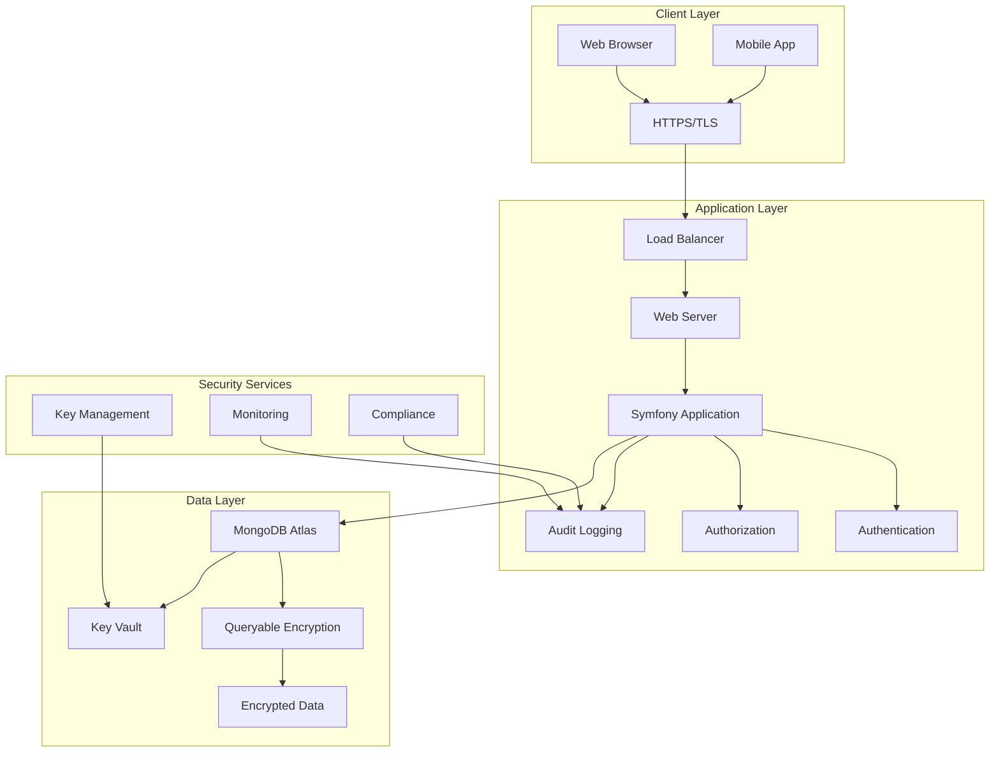
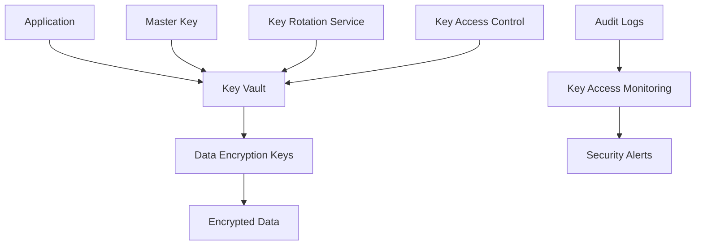

# Security Architecture

SecureHealth implements a comprehensive security architecture designed to meet HIPAA compliance requirements while providing a functional healthcare application. This architecture emphasizes defense in depth, with multiple layers of security controls.

## Security Architecture Overview



## Defense in Depth Strategy

### Layer 1: Network Security

**HTTPS/TLS Encryption**
- All communications encrypted in transit
- TLS 1.3 minimum version
- Perfect Forward Secrecy enabled
- HSTS headers implemented

**Network Segmentation**
- DMZ for web servers
- Internal network for application servers
- Database network isolated
- VPN access for administrative functions

**Firewall Configuration**
```bash
# Example firewall rules
# Allow HTTPS traffic
iptables -A INPUT -p tcp --dport 443 -j ACCEPT

# Allow MongoDB Atlas connections
iptables -A OUTPUT -d mongodb-atlas-cluster.com -p tcp --dport 27017 -j ACCEPT

# Block all other traffic
iptables -A INPUT -j DROP
```

### Layer 2: Application Security

**Authentication**
- Multi-factor authentication support
- Strong password policies
- Session management with timeout
- Account lockout after failed attempts

**Authorization**
- Role-based access control (RBAC)
- Principle of least privilege
- Resource-level permissions
- API endpoint protection

**Input Validation**
- Server-side validation for all inputs
- SQL injection prevention
- XSS protection
- CSRF token validation

### Layer 3: Data Security

**Encryption at Rest**
- MongoDB Queryable Encryption
- AES-256 encryption algorithm
- Separate keys for different data types
- Regular key rotation

**Encryption in Transit**
- TLS for all communications
- Encrypted API endpoints
- Secure file transfers
- Encrypted backups

## MongoDB Queryable Encryption Architecture

### Encryption Schema Design

```javascript
// Encryption schema for patient data
const encryptionSchema = {
  "securehealth.patients": {
    "bsonType": "object",
    "encryptMetadata": {
      "keyId": "/keyId",
      "algorithm": "AEAD_AES_256_CBC_HMAC_SHA_512-Deterministic"
    },
    "properties": {
      // Deterministic encryption for searchable fields
      "patientId": {
        "encrypt": {
          "bsonType": "string",
          "algorithm": "AEAD_AES_256_CBC_HMAC_SHA_512-Deterministic"
        }
      },
      "firstName": {
        "encrypt": {
          "bsonType": "string",
          "algorithm": "AEAD_AES_256_CBC_HMAC_SHA_512-Deterministic"
        }
      },
      "lastName": {
        "encrypt": {
          "bsonType": "string",
          "algorithm": "AEAD_AES_256_CBC_HMAC_SHA_512-Deterministic"
        }
      },
      "email": {
        "encrypt": {
          "bsonType": "string",
          "algorithm": "AEAD_AES_256_CBC_HMAC_SHA_512-Deterministic"
        }
      },
      
      // Range encryption for date/numeric fields
      "dateOfBirth": {
        "encrypt": {
          "bsonType": "date",
          "algorithm": "AEAD_AES_256_CBC_HMAC_SHA_512-Random"
        }
      },
      "appointmentDate": {
        "encrypt": {
          "bsonType": "date",
          "algorithm": "AEAD_AES_256_CBC_HMAC_SHA_512-Random"
        }
      },
      
      // Standard encryption for highly sensitive data
      "ssn": {
        "encrypt": {
          "bsonType": "string",
          "algorithm": "AEAD_AES_256_CBC_HMAC_SHA_512-Random"
        }
      },
      "medicalHistory": {
        "encrypt": {
          "bsonType": "string",
          "algorithm": "AEAD_AES_256_CBC_HMAC_SHA_512-Random"
        }
      },
      "labResults": {
        "encrypt": {
          "bsonType": "string",
          "algorithm": "AEAD_AES_256_CBC_HMAC_SHA_512-Random"
        }
      }
    }
  }
}
```

### Key Management Architecture



## Role-Based Access Control Architecture

### Permission Matrix Implementation

```php
<?php

namespace App\Security;

class PermissionMatrix
{
    private const PERMISSIONS = [
        'ROLE_ADMIN' => [
            'patients' => ['view', 'create', 'edit', 'delete'],
            'users' => ['view', 'create', 'edit', 'delete'],
            'audit_logs' => ['view', 'export'],
            'system' => ['configure', 'backup', 'restore']
        ],
        'ROLE_DOCTOR' => [
            'patients' => ['view', 'edit'],
            'medical_records' => ['view', 'edit'],
            'prescriptions' => ['view', 'create', 'edit'],
            'appointments' => ['view', 'create', 'edit']
        ],
        'ROLE_NURSE' => [
            'patients' => ['view'],
            'medical_records' => ['view'],
            'prescriptions' => ['view'],
            'appointments' => ['view', 'edit']
        ],
        'ROLE_RECEPTIONIST' => [
            'patients' => ['view', 'create'],
            'appointments' => ['view', 'create', 'edit'],
            'insurance' => ['view', 'edit']
        ]
    ];

    public function hasPermission(string $role, string $resource, string $action): bool
    {
        return isset(self::PERMISSIONS[$role][$resource]) && 
               in_array($action, self::PERMISSIONS[$role][$resource]);
    }

    public function getPermissions(string $role): array
    {
        return self::PERMISSIONS[$role] ?? [];
    }
}
```

### Data Filtering Architecture

```php
<?php

namespace App\Service;

class DataFilteringService
{
    public function filterPatientData(Patient $patient, User $user): array
    {
        $baseData = [
            'id' => $patient->getId(),
            'patientId' => $patient->getPatientId(),
            'firstName' => $patient->getFirstName(),
            'lastName' => $patient->getLastName(),
            'dateOfBirth' => $patient->getDateOfBirth()
        ];

        $role = $user->getRoles()[0];
        
        switch ($role) {
            case 'ROLE_ADMIN':
                return $this->getAdminData($patient, $baseData);
            case 'ROLE_DOCTOR':
                return $this->getDoctorData($patient, $baseData);
            case 'ROLE_NURSE':
                return $this->getNurseData($patient, $baseData);
            case 'ROLE_RECEPTIONIST':
                return $this->getReceptionistData($patient, $baseData);
            default:
                return $baseData;
        }
    }

    private function getAdminData(Patient $patient, array $baseData): array
    {
        return array_merge($baseData, [
            'medicalHistory' => $patient->getMedicalHistory(),
            'labResults' => $patient->getLabResults(),
            'prescriptions' => $patient->getPrescriptions(),
            'insurance' => $patient->getInsurance(),
            'auditLogs' => $patient->getAuditLogs()
        ]);
    }

    private function getDoctorData(Patient $patient, array $baseData): array
    {
        return array_merge($baseData, [
            'medicalHistory' => $patient->getMedicalHistory(),
            'labResults' => $patient->getLabResults(),
            'prescriptions' => $patient->getPrescriptions(),
            'insurance' => $patient->getInsurance()
        ]);
    }

    private function getNurseData(Patient $patient, array $baseData): array
    {
        return array_merge($baseData, [
            'medicalHistory' => $patient->getMedicalHistory(),
            'labResults' => $patient->getLabResults(),
            'prescriptions' => $patient->getPrescriptions()
        ]);
    }

    private function getReceptionistData(Patient $patient, array $baseData): array
    {
        return array_merge($baseData, [
            'insurance' => $patient->getInsurance(),
            'appointments' => $patient->getAppointments()
        ]);
    }
}
```

## Audit Logging Architecture

### Comprehensive Audit System

```php
<?php

namespace App\Security;

class AuditArchitecture
{
    private const AUDIT_EVENTS = [
        'AUTHENTICATION' => [
            'LOGIN',
            'LOGIN_FAILED',
            'LOGOUT',
            'PASSWORD_CHANGE'
        ],
        'DATA_ACCESS' => [
            'VIEW_PATIENT',
            'SEARCH_PATIENTS',
            'VIEW_MEDICAL_RECORD',
            'VIEW_LAB_RESULTS'
        ],
        'DATA_MODIFICATION' => [
            'CREATE_PATIENT',
            'UPDATE_PATIENT',
            'DELETE_PATIENT',
            'UPDATE_MEDICAL_RECORD'
        ],
        'ADMINISTRATIVE' => [
            'CREATE_USER',
            'UPDATE_USER',
            'DELETE_USER',
            'CHANGE_PERMISSIONS'
        ],
        'SYSTEM' => [
            'BACKUP_CREATED',
            'BACKUP_RESTORED',
            'KEY_ROTATED',
            'CONFIGURATION_CHANGED'
        ]
    ];

    public function logEvent(string $category, string $action, User $user, $resource = null, array $details = []): void
    {
        if (!isset(self::AUDIT_EVENTS[$category]) || !in_array($action, self::AUDIT_EVENTS[$category])) {
            throw new InvalidArgumentException("Invalid audit event: {$category}.{$action}");
        }

        $auditLog = new AuditLog();
        $auditLog->setCategory($category);
        $auditLog->setAction($action);
        $auditLog->setUser($user);
        $auditLog->setResource($resource);
        $auditLog->setDetails($details);
        $auditLog->setTimestamp(new DateTime());
        $auditLog->setIpAddress($this->getClientIp());
        $auditLog->setUserAgent($this->getUserAgent());
        
        $this->auditRepository->save($auditLog);
    }
}
```

## Security Monitoring Architecture

### Real-time Security Monitoring

```php
<?php

namespace App\Security;

class SecurityMonitoringService
{
    public function monitorSecurityEvents(): void
    {
        $this->monitorFailedLogins();
        $this->monitorPrivilegeEscalation();
        $this->monitorDataAccessPatterns();
        $this->monitorSuspiciousActivity();
    }

    private function monitorFailedLogins(): void
    {
        $recentFailures = $this->auditRepository->findRecentFailures(3600); // Last hour
        
        foreach ($recentFailures as $failure) {
            $failureCount = $this->auditRepository->countFailuresByUser($failure->getUser(), 3600);
            
            if ($failureCount > 5) {
                $this->triggerSecurityAlert('MULTIPLE_LOGIN_FAILURES', [
                    'user' => $failure->getUser(),
                    'failureCount' => $failureCount,
                    'timeframe' => '1_hour'
                ]);
            }
        }
    }

    private function monitorPrivilegeEscalation(): void
    {
        $permissionChanges = $this->auditRepository->findRecentPermissionChanges(86400); // Last 24 hours
        
        foreach ($permissionChanges as $change) {
            $this->triggerSecurityAlert('PRIVILEGE_ESCALATION', [
                'user' => $change->getUser(),
                'oldRole' => $change->getDetails()['oldRole'],
                'newRole' => $change->getDetails()['newRole'],
                'timestamp' => $change->getTimestamp()
            ]);
        }
    }

    private function monitorDataAccessPatterns(): void
    {
        $recentAccess = $this->auditRepository->findRecentAccess(3600);
        
        $userAccessCounts = [];
        foreach ($recentAccess as $access) {
            $userId = $access->getUser()->getId();
            $userAccessCounts[$userId] = ($userAccessCounts[$userId] ?? 0) + 1;
        }
        
        foreach ($userAccessCounts as $userId => $count) {
            if ($count > 100) { // Threshold
                $this->triggerSecurityAlert('EXCESSIVE_DATA_ACCESS', [
                    'userId' => $userId,
                    'accessCount' => $count,
                    'timeframe' => '1_hour'
                ]);
            }
        }
    }

    private function triggerSecurityAlert(string $type, array $details): void
    {
        $alert = new SecurityAlert();
        $alert->setType($type);
        $alert->setDetails($details);
        $alert->setTimestamp(new DateTime());
        $alert->setStatus('ACTIVE');
        
        $this->alertRepository->save($alert);
        
        // Send notification to security team
        $this->notificationService->sendSecurityAlert($alert);
    }
}
```

## Compliance Architecture

### HIPAA Compliance Framework

```php
<?php

namespace App\Compliance;

class HIPAAComplianceService
{
    private const HIPAA_REQUIREMENTS = [
        'ADMINISTRATIVE_SAFEGUARDS' => [
            'SECURITY_OFFICER' => 'Designated security officer',
            'WORKFORCE_TRAINING' => 'Security awareness training',
            'ACCESS_MANAGEMENT' => 'Access control procedures',
            'INFORMATION_ACCESS_MANAGEMENT' => 'Data access policies'
        ],
        'PHYSICAL_SAFEGUARDS' => [
            'FACILITY_ACCESS_CONTROLS' => 'Physical security measures',
            'WORKSTATION_USE' => 'Workstation security policies',
            'DEVICE_CONTROLS' => 'Device and media controls'
        ],
        'TECHNICAL_SAFEGUARDS' => [
            'ACCESS_CONTROL' => 'Unique user identification',
            'AUDIT_CONTROLS' => 'Comprehensive audit logging',
            'INTEGRITY' => 'Data integrity protection',
            'TRANSMISSION_SECURITY' => 'Encrypted communications'
        ]
    ];

    public function validateCompliance(): ComplianceReport
    {
        $report = new ComplianceReport();
        
        foreach (self::HIPAA_REQUIREMENTS as $category => $requirements) {
            $categoryReport = $this->validateCategory($category, $requirements);
            $report->addCategory($category, $categoryReport);
        }
        
        return $report;
    }

    private function validateCategory(string $category, array $requirements): array
    {
        $results = [];
        
        foreach ($requirements as $requirement => $description) {
            $results[$requirement] = [
                'description' => $description,
                'status' => $this->checkRequirement($category, $requirement),
                'evidence' => $this->gatherEvidence($category, $requirement)
            ];
        }
        
        return $results;
    }

    private function checkRequirement(string $category, string $requirement): string
    {
        switch ($category) {
            case 'TECHNICAL_SAFEGUARDS':
                return $this->checkTechnicalSafeguard($requirement);
            case 'ADMINISTRATIVE_SAFEGUARDS':
                return $this->checkAdministrativeSafeguard($requirement);
            case 'PHYSICAL_SAFEGUARDS':
                return $this->checkPhysicalSafeguard($requirement);
            default:
                return 'UNKNOWN';
        }
    }
}
```

## Security Best Practices

### 1. Encryption Best Practices

- **Key Separation**: Use different keys for different data types
- **Key Rotation**: Regularly rotate encryption keys
- **Secure Storage**: Store keys in MongoDB Atlas Key Vault
- **Access Control**: Limit key access to authorized personnel

### 2. Access Control Best Practices

- **Least Privilege**: Grant minimum necessary access
- **Regular Reviews**: Periodically review user permissions
- **Role Separation**: Separate administrative and clinical roles
- **Audit Access**: Log all access control decisions

### 3. Monitoring Best Practices

- **Real-time Monitoring**: Continuous security monitoring
- **Alert Thresholds**: Set appropriate alert thresholds
- **Incident Response**: Implement incident response procedures
- **Regular Testing**: Test security controls regularly

### 4. Compliance Best Practices

- **Documentation**: Maintain comprehensive security documentation
- **Training**: Regular security awareness training
- **Assessments**: Periodic security assessments
- **Updates**: Keep security controls current

## Security Architecture Diagram

```mermaid
graph TB
    subgraph "Security Layers"
        A[Network Security] --> B[Application Security]
        B --> C[Data Security]
        C --> D[Monitoring & Compliance]
    end
    
    subgraph "Network Security"
        E[HTTPS/TLS] --> F[Firewall]
        F --> G[Network Segmentation]
    end
    
    subgraph "Application Security"
        H[Authentication] --> I[Authorization]
        I --> J[Input Validation]
        J --> K[Session Management]
    end
    
    subgraph "Data Security"
        L[Queryable Encryption] --> M[Key Management]
        M --> N[Data Filtering]
        N --> O[Audit Logging]
    end
    
    subgraph "Monitoring & Compliance"
        P[Real-time Monitoring] --> Q[Security Alerts]
        Q --> R[Compliance Reporting]
        R --> S[Incident Response]
    end
```



## Next Steps

- **[User Guides](/docs/user-guides/admin-guide)** - Role-specific documentation
- **[Developer Guides](/docs/developer-guides/architecture)** - Technical implementation details
- **[Tutorials](/docs/tutorials/encryption-setup)** - Step-by-step implementation guides
- **[Reference](/docs/reference/troubleshooting)** - Common issues and solutions
