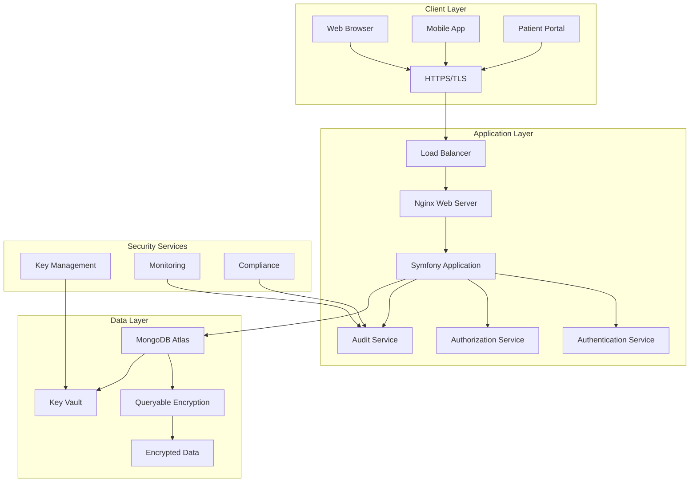
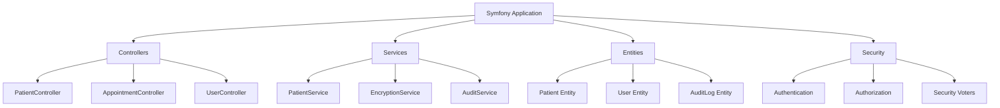
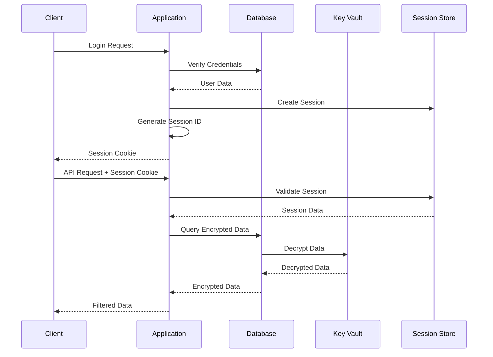

# System Architecture

SecureHealth is built with a modern, secure architecture designed to meet HIPAA compliance requirements while providing excellent performance and scalability. This guide covers the overall system architecture, component relationships, and technical implementation details.

## Architecture Overview



## Technology Stack

### Backend Technologies

:::success Symfony Framework
- **Version**: Symfony 6.x
- **PHP Version**: PHP 8.1+
- **Architecture**: MVC pattern with service-oriented design
- **Security**: Built-in security components and voters
:::

:::info MongoDB Atlas
- **Database**: MongoDB 6.0+
- **Encryption**: Queryable Encryption (CSFLE)
- **Hosting**: MongoDB Atlas cloud service
- **Backup**: Automated backups with point-in-time recovery

**Authentication & Authorization**
- **Session-Based Authentication**: Secure PHP sessions for user authentication
- **RBAC**: Role-based access control
- **Security Voters**: Fine-grained permission system
- **Session Management**: Secure session handling with encryption

### Frontend Technologies

**Modern Web Standards**
- **HTML5**: Semantic markup
- **CSS3**: Responsive design with CSS Grid/Flexbox
- **JavaScript**: ES6+ with modern frameworks
- **Progressive Web App**: PWA capabilities

**Security Features**
- **HTTPS**: TLS 1.3 encryption
- **CSP**: Content Security Policy
- **HSTS**: HTTP Strict Transport Security
- **XSS Protection**: Cross-site scripting prevention

## Component Architecture

### Application Components



### Service Layer Architecture

**Core Services**
- **PatientService**: Patient data management
- **UserService**: User management and authentication
- **EncryptionService**: MongoDB Queryable Encryption
- **AuditService**: Comprehensive audit logging
- **NotificationService**: Email and SMS notifications

**Security Services**
- **AuthenticationService**: User authentication
- **AuthorizationService**: Permission management
- **SecurityMonitoringService**: Real-time security monitoring
- **ComplianceService**: HIPAA compliance management

## Data Architecture

### MongoDB Document Structure

**Patient Document**
```javascript
{
  "_id": ObjectId("..."),
  "patientId": "PAT-12345", // Deterministic encryption
  "firstName": "John", // Deterministic encryption
  "lastName": "Doe", // Deterministic encryption
  "dateOfBirth": ISODate("1990-05-15"), // Range encryption
  "ssn": "123-45-6789", // Standard encryption
  "email": "john.doe@email.com", // Deterministic encryption
  "phone": "+1-555-123-4567", // Deterministic encryption
  "address": {
    "street": "123 Main St",
    "city": "Anytown",
    "state": "CA",
    "zipCode": "12345"
  },
  "medicalHistory": "Patient has diabetes...", // Standard encryption
  "labResults": [
    {
      "testDate": ISODate("2024-01-15"), // Range encryption
      "testType": "Blood Glucose",
      "result": "150 mg/dL",
      "normalRange": "70-100 mg/dL"
    }
  ],
  "prescriptions": [
    {
      "medication": "Metformin",
      "dosage": "500mg",
      "frequency": "Twice daily",
      "startDate": ISODate("2024-01-01"), // Range encryption
      "endDate": ISODate("2024-12-31") // Range encryption
    }
  ],
  "appointments": [
    {
      "date": ISODate("2024-01-15"), // Range encryption
      "doctor": "Dr. Smith",
      "type": "Follow-up",
      "notes": "Regular checkup" // Standard encryption
    }
  ],
  "createdAt": ISODate("2024-01-01"),
  "updatedAt": ISODate("2024-01-15")
}
```

**User Document**
```javascript
{
  "_id": ObjectId("..."),
  "email": "doctor@securehealth.dev",
  "firstName": "Dr. Jane",
  "lastName": "Smith",
  "roles": ["ROLE_DOCTOR"],
  "department": "Cardiology",
  "isActive": true,
  "lastLogin": ISODate("2024-01-15T10:30:00Z"),
  "createdAt": ISODate("2024-01-01"),
  "updatedAt": ISODate("2024-01-15")
}
```

**AuditLog Document**
```javascript
{
  "_id": ObjectId("..."),
  "timestamp": ISODate("2024-01-15T10:30:00Z"),
  "user": {
    "id": "user_456",
    "email": "doctor@securehealth.dev",
    "role": "ROLE_DOCTOR"
  },
  "action": "VIEW_PATIENT",
  "resource": {
    "type": "Patient",
    "id": "patient_789",
    "patientId": "PAT-12345"
  },
  "request": {
    "method": "GET",
    "url": "/api/patients/PAT-12345",
    "ipAddress": "192.168.1.100",
    "userAgent": "Mozilla/5.0...",
    "sessionId": "session_abc123"
  },
  "result": {
    "status": "SUCCESS",
    "httpCode": 200,
    "responseTime": 150
  },
  "compliance": {
    "hipaaCompliant": true,
    "auditRequired": true,
    "retentionPeriod": "7_years"
  },
  "encryptedDetails": "encrypted_data_here",
  "createdAt": ISODate("2024-01-15T10:30:00Z")
}
```

### Encryption Schema

**Field-Level Encryption Configuration**
```javascript
const encryptionSchema = {
  "securehealth.patients": {
    "bsonType": "object",
    "encryptMetadata": {
      "keyId": "/keyId",
      "algorithm": "AEAD_AES_256_CBC_HMAC_SHA_512-Deterministic"
    },
    "properties": {
      "patientId": {
        "encrypt": {
          "bsonType": "string",
          "algorithm": "AEAD_AES_256_CBC_HMAC_SHA_512-Deterministic"
        }
      },
      "firstName": {
        "encrypt": {
          "bsonType": "string",
          "algorithm": "AEAD_AES_256_CBC_HMAC_SHA_512-Deterministic"
        }
      },
      "lastName": {
        "encrypt": {
          "bsonType": "string",
          "algorithm": "AEAD_AES_256_CBC_HMAC_SHA_512-Deterministic"
        }
      },
      "dateOfBirth": {
        "encrypt": {
          "bsonType": "date",
          "algorithm": "AEAD_AES_256_CBC_HMAC_SHA_512-Random"
        }
      },
      "ssn": {
        "encrypt": {
          "bsonType": "string",
          "algorithm": "AEAD_AES_256_CBC_HMAC_SHA_512-Random"
        }
      },
      "medicalHistory": {
        "encrypt": {
          "bsonType": "string",
          "algorithm": "AEAD_AES_256_CBC_HMAC_SHA_512-Random"
        }
      }
    }
  }
}
```

## Security Architecture

### Authentication Flow



### Authorization System

**Role-Based Access Control**
```php
<?php

namespace App\Security;

class RoleHierarchy
{
    private const HIERARCHY = [
        'ROLE_ADMIN' => ['ROLE_DOCTOR', 'ROLE_NURSE', 'ROLE_RECEPTIONIST'],
        'ROLE_DOCTOR' => ['ROLE_NURSE', 'ROLE_RECEPTIONIST'],
        'ROLE_NURSE' => ['ROLE_RECEPTIONIST'],
        'ROLE_RECEPTIONIST' => []
    ];

    public function getReachableRoles(array $roles): array
    {
        $reachableRoles = $roles;
        
        foreach ($roles as $role) {
            if (isset(self::HIERARCHY[$role])) {
                $reachableRoles = array_merge($reachableRoles, self::HIERARCHY[$role]);
            }
        }
        
        return array_unique($reachableRoles);
    }
}
```

**Security Voter Implementation**
```php
<?php

namespace App\Security\Voter;

use App\Entity\Patient;
use App\Entity\User;
use Symfony\Component\Security\Core\Authentication\Token\TokenInterface;
use Symfony\Component\Security\Core\Authorization\Voter\Voter;

class PatientVoter extends Voter
{
    const VIEW = 'view';
    const EDIT = 'edit';
    const DELETE = 'delete';
    const VIEW_MEDICAL = 'view_medical';
    const VIEW_INSURANCE = 'view_insurance';

    protected function supports(string $attribute, $subject): bool
    {
        return in_array($attribute, [self::VIEW, self::EDIT, self::DELETE, self::VIEW_MEDICAL, self::VIEW_INSURANCE])
            && $subject instanceof Patient;
    }

    protected function voteOnAttribute(string $attribute, $subject, TokenInterface $token): bool
    {
        $user = $token->getUser();
        
        if (!$user instanceof User) {
            return false;
        }

        $patient = $subject;

        switch ($attribute) {
            case self::VIEW:
                return $this->canView($user, $patient);
            case self::EDIT:
                return $this->canEdit($user, $patient);
            case self::DELETE:
                return $this->canDelete($user, $patient);
            case self::VIEW_MEDICAL:
                return $this->canViewMedical($user, $patient);
            case self::VIEW_INSURANCE:
                return $this->canViewInsurance($user, $patient);
        }

        return false;
    }

    private function canView(User $user, Patient $patient): bool
    {
        return true; // All authenticated users can view basic patient info
    }

    private function canEdit(User $user, Patient $patient): bool
    {
        return in_array('ROLE_DOCTOR', $user->getRoles()) || 
               in_array('ROLE_ADMIN', $user->getRoles());
    }

    private function canDelete(User $user, Patient $patient): bool
    {
        return in_array('ROLE_ADMIN', $user->getRoles());
    }

    private function canViewMedical(User $user, Patient $patient): bool
    {
        return in_array('ROLE_DOCTOR', $user->getRoles()) || 
               in_array('ROLE_NURSE', $user->getRoles()) ||
               in_array('ROLE_ADMIN', $user->getRoles());
    }

    private function canViewInsurance(User $user, Patient $patient): bool
    {
        return in_array('ROLE_DOCTOR', $user->getRoles()) || 
               in_array('ROLE_RECEPTIONIST', $user->getRoles()) ||
               in_array('ROLE_ADMIN', $user->getRoles());
    }
}
```

## API Architecture

### RESTful API Design

:::info Session-Based API Authentication
SecureHealth uses PHP sessions for API authentication instead of JWT tokens. This provides better security for healthcare applications and integrates seamlessly with Symfony's security system.
:::

**API Endpoints**
```php title="PatientController.php"
<?php

namespace App\Controller;

use App\Entity\Patient;
use Symfony\Bundle\FrameworkBundle\Controller\AbstractController;
use Symfony\Component\HttpFoundation\JsonResponse;
use Symfony\Component\Routing\Annotation\Route;
use Symfony\Component\Security\Http\Attribute\IsGranted;

class PatientController extends AbstractController
{
    #[Route('/api/patients', methods: ['GET'])]
    #[IsGranted('ROLE_USER')]
    public function listPatients(): JsonResponse
    {
        // Session-based authentication - user is automatically available
        $user = $this->getUser();
        $patients = $this->patientRepository->findAll();
        
        $filteredPatients = array_map(function($patient) use ($user) {
            return $this->patientDataFilter->filterPatientData($patient, $user);
        }, $patients);
        
        return $this->json($filteredPatients);
    }

    #[Route('/api/patients/{id}', methods: ['GET'])]
    #[IsGranted('ROLE_USER')]
    public function viewPatient(Patient $patient): JsonResponse
    {
        $this->denyAccessUnlessGranted('VIEW', $patient);
        
        $user = $this->getUser();
        $filteredData = $this->patientDataFilter->filterPatientData($patient, $user);
        
        return $this->json($filteredData);
    }

    #[Route('/api/patients/{id}/medical', methods: ['GET'])]
    #[IsGranted('ROLE_DOCTOR')]
    public function viewMedicalData(Patient $patient): JsonResponse
    {
        $this->denyAccessUnlessGranted('VIEW_MEDICAL', $patient);
        
        $medicalData = [
            'medicalHistory' => $patient->getMedicalHistory(),
            'labResults' => $patient->getLabResults(),
            'prescriptions' => $patient->getPrescriptions(),
            'diagnoses' => $patient->getDiagnoses(),
        ];
        
        return $this->json($medicalData);
    }
}
```

### Data Filtering Service

```php
<?php

namespace App\Service;

use App\Entity\Patient;
use App\Entity\User;

class PatientDataFilter
{
    public function filterPatientData(Patient $patient, User $user): array
    {
        $baseData = [
            'id' => $patient->getId(),
            'patientId' => $patient->getPatientId(),
            'firstName' => $patient->getFirstName(),
            'lastName' => $patient->getLastName(),
            'dateOfBirth' => $patient->getDateOfBirth(),
        ];

        $role = $user->getRoles()[0];
        
        switch ($role) {
            case 'ROLE_ADMIN':
                return $this->getAdminData($patient, $baseData);
            case 'ROLE_DOCTOR':
                return $this->getDoctorData($patient, $baseData);
            case 'ROLE_NURSE':
                return $this->getNurseData($patient, $baseData);
            case 'ROLE_RECEPTIONIST':
                return $this->getReceptionistData($patient, $baseData);
            default:
                return $baseData;
        }
    }

    private function getAdminData(Patient $patient, array $baseData): array
    {
        return array_merge($baseData, [
            'medicalHistory' => $patient->getMedicalHistory(),
            'labResults' => $patient->getLabResults(),
            'prescriptions' => $patient->getPrescriptions(),
            'insurance' => $patient->getInsurance(),
            'auditLogs' => $patient->getAuditLogs()
        ]);
    }

    private function getDoctorData(Patient $patient, array $baseData): array
    {
        return array_merge($baseData, [
            'medicalHistory' => $patient->getMedicalHistory(),
            'labResults' => $patient->getLabResults(),
            'prescriptions' => $patient->getPrescriptions(),
            'insurance' => $patient->getInsurance()
        ]);
    }

    private function getNurseData(Patient $patient, array $baseData): array
    {
        return array_merge($baseData, [
            'medicalHistory' => $patient->getMedicalHistory(),
            'labResults' => $patient->getLabResults(),
            'prescriptions' => $patient->getPrescriptions()
        ]);
    }

    private function getReceptionistData(Patient $patient, array $baseData): array
    {
        return array_merge($baseData, [
            'insurance' => $patient->getInsurance(),
            'appointments' => $patient->getAppointments()
        ]);
    }
}
```

## Deployment Architecture

### Production Environment

**Infrastructure Components**
- **Load Balancer**: Nginx with SSL termination
- **Application Servers**: Multiple Symfony instances
- **Database**: MongoDB Atlas cluster
- **Session Storage**: Redis for secure session management
- **Monitoring**: Application and infrastructure monitoring

**Security Measures**
- **Network Security**: VPC with private subnets
- **SSL/TLS**: End-to-end encryption
- **Firewall**: Web Application Firewall (WAF)
- **DDoS Protection**: Cloud-based DDoS protection

### Scalability Considerations

**Horizontal Scaling**
- **Application Layer**: Multiple Symfony instances
- **Database Layer**: MongoDB replica sets
- **Session Layer**: Redis cluster for session storage
- **Load Balancing**: Sticky sessions with health checks

**Performance Optimization**
- **Caching**: Application and database caching
- **CDN**: Content delivery network
- **Database Indexing**: Optimized MongoDB indexes
- **Query Optimization**: Efficient database queries

## Monitoring and Observability

### Application Monitoring

**Metrics Collection**
- **Performance Metrics**: Response times, throughput
- **Error Rates**: Application and database errors
- **Resource Usage**: CPU, memory, disk usage
- **Security Metrics**: Failed logins, access patterns

**Logging Strategy**
- **Application Logs**: Symfony application logs
- **Audit Logs**: Comprehensive audit trail
- **Security Logs**: Security events and incidents
- **System Logs**: Infrastructure and system logs

### Compliance Monitoring

**HIPAA Compliance**
- **Access Monitoring**: Track all data access
- **Audit Trail**: Complete audit logging
- **Security Incidents**: Monitor for security events
- **Compliance Reporting**: Automated compliance reports

## Next Steps

- **[API Reference](/docs/developer-guides/api-reference)** - Complete API documentation
- **[Database Schema](/docs/developer-guides/database-schema)** - MongoDB document structure
- **[Security Implementation](/docs/developer-guides/security-implementation)** - Security patterns
- **[Testing](/docs/developer-guides/testing)** - Testing strategies
- **[Deployment](/docs/developer-guides/deployment)** - Production deployment
