# Security Implementation

SecureHealth implements comprehensive security measures to ensure HIPAA compliance and protect patient data. This guide covers the security patterns, implementations, and best practices used throughout the system.

## Security Architecture Overview

```mermaid
graph TB
    subgraph "Security Layers"
        A[Network Security] --> B[Application Security]
        B --> C[Data Security]
        C --> D[Monitoring & Compliance]
    end
    
    subgraph "Network Security"
        E[HTTPS/TLS] --> F[Firewall]
        F --> G[Network Segmentation]
    end
    
    subgraph "Application Security"
        H[Authentication] --> I[Authorization]
        I --> J[Input Validation]
        J --> K[Session Management]
    end
    
    subgraph "Data Security"
        L[Queryable Encryption] --> M[Key Management]
        M --> N[Data Filtering]
        N --> O[Audit Logging]
    end
    
    subgraph "Monitoring & Compliance"
        P[Real-time Monitoring] --> Q[Security Alerts]
        Q --> R[Compliance Reporting]
        R --> S[Incident Response]
    end
```



## Authentication Implementation

### JWT Token Authentication

**Token Generation**
```php
<?php

namespace App\Security;

use Firebase\JWT\JWT;
use Firebase\JWT\Key;

class JWTTokenManager
{
    private string $secretKey;
    private int $tokenLifetime;

    public function __construct(string $secretKey, int $tokenLifetime = 3600)
    {
        $this->secretKey = $secretKey;
        $this->tokenLifetime = $tokenLifetime;
    }

    public function generateToken(User $user): string
    {
        $payload = [
            'iss' => 'securehealth.dev',
            'aud' => 'securehealth.dev',
            'iat' => time(),
            'exp' => time() + $this->tokenLifetime,
            'sub' => $user->getId(),
            'email' => $user->getEmail(),
            'roles' => $user->getRoles(),
            'department' => $user->getDepartment()
        ];

        return JWT::encode($payload, $this->secretKey, 'HS256');
    }

    public function validateToken(string $token): array
    {
        try {
            $decoded = JWT::decode($token, new Key($this->secretKey, 'HS256'));
            return (array) $decoded;
        } catch (\Exception $e) {
            throw new InvalidTokenException('Invalid token: ' . $e->getMessage());
        }
    }

    public function refreshToken(string $token): string
    {
        $payload = $this->validateToken($token);
        
        // Create new token with extended expiration
        $newPayload = $payload;
        $newPayload['iat'] = time();
        $newPayload['exp'] = time() + $this->tokenLifetime;
        
        return JWT::encode($newPayload, $this->secretKey, 'HS256');
    }
}
```

**Authentication Listener**
```php
<?php

namespace App\EventListener;

use App\Security\JWTTokenManager;
use Symfony\Component\HttpFoundation\JsonResponse;
use Symfony\Component\HttpKernel\Event\RequestEvent;
use Symfony\Component\Security\Core\Exception\AuthenticationException;

class JWTAuthenticationListener
{
    private JWTTokenManager $tokenManager;
    private array $publicRoutes;

    public function __construct(JWTTokenManager $tokenManager, array $publicRoutes = [])
    {
        $this->tokenManager = $tokenManager;
        $this->publicRoutes = $publicRoutes;
    }

    public function onKernelRequest(RequestEvent $event): void
    {
        $request = $event->getRequest();
        
        // Skip authentication for public routes
        if (in_array($request->getPathInfo(), $this->publicRoutes)) {
            return;
        }

        // Skip authentication for non-API routes
        if (!str_starts_with($request->getPathInfo(), '/api/')) {
            return;
        }

        $authHeader = $request->headers->get('Authorization');
        
        if (!$authHeader || !str_starts_with($authHeader, 'Bearer ')) {
            $this->handleAuthenticationError($event, 'Missing or invalid authorization header');
            return;
        }

        $token = substr($authHeader, 7);
        
        try {
            $payload = $this->tokenManager->validateToken($token);
            $request->attributes->set('jwt_payload', $payload);
        } catch (InvalidTokenException $e) {
            $this->handleAuthenticationError($event, $e->getMessage());
        }
    }

    private function handleAuthenticationError(RequestEvent $event, string $message): void
    {
        $response = new JsonResponse([
            'error' => [
                'code' => 'AUTHENTICATION_REQUIRED',
                'message' => $message
            ]
        ], 401);

        $event->setResponse($response);
    }
}
```

## Authorization Implementation

### Role-Based Access Control

**Security Voter System**
```php
<?php

namespace App\Security\Voter;

use App\Entity\Patient;
use App\Entity\User;
use Symfony\Component\Security\Core\Authentication\Token\TokenInterface;
use Symfony\Component\Security\Core\Authorization\Voter\Voter;

class PatientVoter extends Voter
{
    const VIEW = 'view';
    const EDIT = 'edit';
    const DELETE = 'delete';
    const VIEW_MEDICAL = 'view_medical';
    const VIEW_INSURANCE = 'view_insurance';

    protected function supports(string $attribute, $subject): bool
    {
        return in_array($attribute, [self::VIEW, self::EDIT, self::DELETE, self::VIEW_MEDICAL, self::VIEW_INSURANCE])
            && $subject instanceof Patient;
    }

    protected function voteOnAttribute(string $attribute, $subject, TokenInterface $token): bool
    {
        $user = $token->getUser();
        
        if (!$user instanceof User) {
            return false;
        }

        $patient = $subject;

        switch ($attribute) {
            case self::VIEW:
                return $this->canView($user, $patient);
            case self::EDIT:
                return $this->canEdit($user, $patient);
            case self::DELETE:
                return $this->canDelete($user, $patient);
            case self::VIEW_MEDICAL:
                return $this->canViewMedical($user, $patient);
            case self::VIEW_INSURANCE:
                return $this->canViewInsurance($user, $patient);
        }

        return false;
    }

    private function canView(User $user, Patient $patient): bool
    {
        // All authenticated users can view basic patient info
        return true;
    }

    private function canEdit(User $user, Patient $patient): bool
    {
        // Only doctors and admins can edit patient records
        return in_array('ROLE_DOCTOR', $user->getRoles()) || 
               in_array('ROLE_ADMIN', $user->getRoles());
    }

    private function canDelete(User $user, Patient $patient): bool
    {
        // Only admins can delete patients
        return in_array('ROLE_ADMIN', $user->getRoles());
    }

    private function canViewMedical(User $user, Patient $patient): bool
    {
        // Doctors, nurses, and admins can view medical data
        return in_array('ROLE_DOCTOR', $user->getRoles()) || 
               in_array('ROLE_NURSE', $user->getRoles()) ||
               in_array('ROLE_ADMIN', $user->getRoles());
    }

    private function canViewInsurance(User $user, Patient $patient): bool
    {
        // Doctors, receptionists, and admins can view insurance
        return in_array('ROLE_DOCTOR', $user->getRoles()) || 
               in_array('ROLE_RECEPTIONIST', $user->getRoles()) ||
               in_array('ROLE_ADMIN', $user->getRoles());
    }
}
```

**Data Filtering Service**
```php
<?php

namespace App\Service;

use App\Entity\Patient;
use App\Entity\User;

class PatientDataFilter
{
    public function filterPatientData(Patient $patient, User $user): array
    {
        $baseData = [
            'id' => $patient->getId(),
            'patientId' => $patient->getPatientId(),
            'firstName' => $patient->getFirstName(),
            'lastName' => $patient->getLastName(),
            'dateOfBirth' => $patient->getDateOfBirth(),
        ];

        $role = $user->getRoles()[0];
        
        switch ($role) {
            case 'ROLE_ADMIN':
                return $this->getAdminData($patient, $baseData);
            case 'ROLE_DOCTOR':
                return $this->getDoctorData($patient, $baseData);
            case 'ROLE_NURSE':
                return $this->getNurseData($patient, $baseData);
            case 'ROLE_RECEPTIONIST':
                return $this->getReceptionistData($patient, $baseData);
            default:
                return $baseData;
        }
    }

    private function getAdminData(Patient $patient, array $baseData): array
    {
        return array_merge($baseData, [
            'medicalHistory' => $patient->getMedicalHistory(),
            'labResults' => $patient->getLabResults(),
            'prescriptions' => $patient->getPrescriptions(),
            'insurance' => $patient->getInsurance(),
            'auditLogs' => $patient->getAuditLogs()
        ]);
    }

    private function getDoctorData(Patient $patient, array $baseData): array
    {
        return array_merge($baseData, [
            'medicalHistory' => $patient->getMedicalHistory(),
            'labResults' => $patient->getLabResults(),
            'prescriptions' => $patient->getPrescriptions(),
            'insurance' => $patient->getInsurance()
        ]);
    }

    private function getNurseData(Patient $patient, array $baseData): array
    {
        return array_merge($baseData, [
            'medicalHistory' => $patient->getMedicalHistory(),
            'labResults' => $patient->getLabResults(),
            'prescriptions' => $patient->getPrescriptions()
        ]);
    }

    private function getReceptionistData(Patient $patient, array $baseData): array
    {
        return array_merge($baseData, [
            'insurance' => $patient->getInsurance(),
            'appointments' => $patient->getAppointments()
        ]);
    }
}
```

## Encryption Implementation

### MongoDB Queryable Encryption

**Encryption Service**
```php
<?php

namespace App\Service;

use MongoDB\Client;
use MongoDB\Driver\Manager;
use MongoDB\Driver\BulkWrite;
use MongoDB\Driver\Query;

class MongoDBEncryptionService
{
    private Manager $manager;
    private array $encryptionSchema;
    private string $keyVaultNamespace;

    public function __construct(string $connectionString, array $encryptionSchema, string $keyVaultNamespace)
    {
        $this->encryptionSchema = $encryptionSchema;
        $this->keyVaultNamespace = $keyVaultNamespace;
        
        $this->manager = new Manager($connectionString, [
            'autoEncryption' => [
                'keyVaultNamespace' => $keyVaultNamespace,
                'kmsProviders' => [
                    'local' => [
                        'key' => base64_decode($_ENV['ENCRYPTION_MASTER_KEY'])
                    ]
                ],
                'schemaMap' => $encryptionSchema
            ]
        ]);
    }

    public function createPatient(array $patientData): string
    {
        $bulk = new BulkWrite();
        $bulk->insert($patientData);
        
        $result = $this->manager->executeBulkWrite('securehealth.patients', $bulk);
        
        return (string) $result->getInsertedIds()[0];
    }

    public function findPatient(string $patientId): ?array
    {
        $query = new Query(['patientId' => $patientId]);
        $cursor = $this->manager->executeQuery('securehealth.patients', $query);
        
        $results = $cursor->toArray();
        return empty($results) ? null : (array) $results[0];
    }

    public function searchPatients(array $criteria): array
    {
        $query = new Query($criteria);
        $cursor = $this->manager->executeQuery('securehealth.patients', $query);
        
        return array_map(function($document) {
            return (array) $document;
        }, $cursor->toArray());
    }

    public function updatePatient(string $patientId, array $updateData): bool
    {
        $bulk = new BulkWrite();
        $bulk->update(
            ['patientId' => $patientId],
            ['$set' => $updateData]
        );
        
        $result = $this->manager->executeBulkWrite('securehealth.patients', $bulk);
        
        return $result->getModifiedCount() > 0;
    }
}
```

**Encryption Configuration**
```php
<?php

namespace App\Config;

class EncryptionConfig
{
    public static function getEncryptionSchema(): array
    {
        return [
            'securehealth.patients' => [
                'bsonType' => 'object',
                'encryptMetadata' => [
                    'keyId' => '/keyId',
                    'algorithm' => 'AEAD_AES_256_CBC_HMAC_SHA_512-Deterministic'
                ],
                'properties' => [
                    'patientId' => [
                        'encrypt' => [
                            'bsonType' => 'string',
                            'algorithm' => 'AEAD_AES_256_CBC_HMAC_SHA_512-Deterministic'
                        ]
                    ],
                    'firstName' => [
                        'encrypt' => [
                            'bsonType' => 'string',
                            'algorithm' => 'AEAD_AES_256_CBC_HMAC_SHA_512-Deterministic'
                        ]
                    ],
                    'lastName' => [
                        'encrypt' => [
                            'bsonType' => 'string',
                            'algorithm' => 'AEAD_AES_256_CBC_HMAC_SHA_512-Deterministic'
                        ]
                    ],
                    'dateOfBirth' => [
                        'encrypt' => [
                            'bsonType' => 'date',
                            'algorithm' => 'AEAD_AES_256_CBC_HMAC_SHA_512-Random'
                        ]
                    ],
                    'ssn' => [
                        'encrypt' => [
                            'bsonType' => 'string',
                            'algorithm' => 'AEAD_AES_256_CBC_HMAC_SHA_512-Random'
                        ]
                    ],
                    'medicalHistory' => [
                        'encrypt' => [
                            'bsonType' => 'string',
                            'algorithm' => 'AEAD_AES_256_CBC_HMAC_SHA_512-Random'
                        ]
                    ]
                ]
            ]
        ];
    }
}
```

## Audit Logging Implementation

### Comprehensive Audit System

**Audit Logger Service**
```php
<?php

namespace App\Service;

use App\Entity\AuditLog;
use App\Entity\User;
use Symfony\Component\HttpFoundation\Request;

class AuditLogger
{
    private $auditRepository;
    private $encryptionService;

    public function logAccess(User $user, string $action, $resource, Request $request, array $details = []): void
    {
        $auditLog = new AuditLog();
        
        // Basic information
        $auditLog->setUser($user);
        $auditLog->setAction($action);
        $auditLog->setTimestamp(new DateTime());
        
        // Resource information
        if ($resource) {
            $auditLog->setResourceType(get_class($resource));
            $auditLog->setResourceId($resource->getId());
            
            if (method_exists($resource, 'getPatientId')) {
                $auditLog->setPatientId($resource->getPatientId());
            }
        }
        
        // Request information
        $auditLog->setIpAddress($request->getClientIp());
        $auditLog->setUserAgent($request->headers->get('User-Agent'));
        $auditLog->setRequestMethod($request->getMethod());
        $auditLog->setRequestUrl($request->getUri());
        $auditLog->setSessionId($request->getSession()->getId());
        
        // Additional details
        $auditLog->setDetails($details);
        
        // Compliance information
        $auditLog->setHipaaCompliant(true);
        $auditLog->setAuditRequired(true);
        $auditLog->setRetentionPeriod('7_years');
        
        // Encrypt sensitive audit data
        $this->encryptAuditLog($auditLog);
        
        $this->auditRepository->save($auditLog);
    }

    public function logAuthentication(User $user, string $action, Request $request, bool $success, string $failureReason = null): void
    {
        $auditLog = new AuditLog();
        
        $auditLog->setUser($user);
        $auditLog->setAction($action);
        $auditLog->setTimestamp(new DateTime());
        $auditLog->setIpAddress($request->getClientIp());
        $auditLog->setUserAgent($request->headers->get('User-Agent'));
        $auditLog->setResult($success ? 'SUCCESS' : 'FAILURE');
        
        $details = [
            'success' => $success,
            'failureReason' => $failureReason,
            'loginMethod' => 'PASSWORD'
        ];
        
        $auditLog->setDetails($details);
        $auditLog->setHipaaCompliant(true);
        $auditLog->setAuditRequired(true);
        
        $this->auditRepository->save($auditLog);
    }

    private function encryptAuditLog(AuditLog $auditLog): void
    {
        // Encrypt sensitive fields in audit log
        if ($auditLog->getDetails()) {
            $encryptedDetails = $this->encryptionService->encrypt(json_encode($auditLog->getDetails()));
            $auditLog->setEncryptedDetails($encryptedDetails);
            $auditLog->setDetails(null); // Remove unencrypted data
        }
    }
}
```

**Audit Event Listener**
```php
<?php

namespace App\EventListener;

use App\Service\AuditLogger;
use Symfony\Component\HttpKernel\Event\RequestEvent;
use Symfony\Component\Security\Core\Event\AuthenticationEvent;
use Symfony\Component\Security\Core\Event\AuthenticationFailureEvent;

class AuditEventListener
{
    private AuditLogger $auditLogger;

    public function __construct(AuditLogger $auditLogger)
    {
        $this->auditLogger = $auditLogger;
    }

    public function onAuthenticationSuccess(AuthenticationEvent $event): void
    {
        $user = $event->getAuthenticationToken()->getUser();
        $request = $this->getCurrentRequest();
        
        if ($request) {
            $this->auditLogger->logAuthentication($user, 'LOGIN', $request, true);
        }
    }

    public function onAuthenticationFailure(AuthenticationFailureEvent $event): void
    {
        $token = $event->getAuthenticationToken();
        $user = $token->getUser();
        $request = $this->getCurrentRequest();
        
        if ($request && $user) {
            $this->auditLogger->logAuthentication($user, 'LOGIN_FAILED', $request, false, 'INVALID_CREDENTIALS');
        }
    }

    public function onKernelRequest(RequestEvent $event): void
    {
        $request = $event->getRequest();
        
        // Log API requests
        if (str_starts_with($request->getPathInfo(), '/api/')) {
            $this->logApiRequest($request);
        }
    }

    private function logApiRequest(Request $request): void
    {
        $user = $this->getCurrentUser();
        if (!$user) {
            return;
        }

        $action = $this->determineAction($request);
        $resource = $this->extractResource($request);
        
        $this->auditLogger->logAccess($user, $action, $resource, $request);
    }

    private function determineAction(Request $request): string
    {
        $method = $request->getMethod();
        $path = $request->getPathInfo();
        
        if (str_contains($path, '/patients')) {
            return match($method) {
                'GET' => 'VIEW_PATIENT',
                'POST' => 'CREATE_PATIENT',
                'PUT', 'PATCH' => 'UPDATE_PATIENT',
                'DELETE' => 'DELETE_PATIENT',
                default => 'UNKNOWN_ACTION'
            };
        }
        
        return 'UNKNOWN_ACTION';
    }
}
```

## Security Monitoring

### Real-time Security Monitoring

**Security Monitor Service**
```php
<?php

namespace App\Service;

class SecurityMonitoringService
{
    public function monitorSecurityEvents(): void
    {
        $this->monitorFailedLogins();
        $this->monitorPrivilegeEscalation();
        $this->monitorDataAccessPatterns();
        $this->monitorSuspiciousActivity();
    }

    private function monitorFailedLogins(): void
    {
        $recentFailures = $this->auditRepository->findRecentFailures(3600); // Last hour
        
        foreach ($recentFailures as $failure) {
            $failureCount = $this->auditRepository->countFailuresByUser($failure->getUser(), 3600);
            
            if ($failureCount > 5) {
                $this->triggerSecurityAlert('MULTIPLE_LOGIN_FAILURES', [
                    'user' => $failure->getUser(),
                    'failureCount' => $failureCount,
                    'timeframe' => '1_hour'
                ]);
            }
        }
    }

    private function monitorPrivilegeEscalation(): void
    {
        $permissionChanges = $this->auditRepository->findRecentPermissionChanges(86400); // Last 24 hours
        
        foreach ($permissionChanges as $change) {
            $this->triggerSecurityAlert('PRIVILEGE_ESCALATION', [
                'user' => $change->getUser(),
                'oldRole' => $change->getDetails()['oldRole'],
                'newRole' => $change->getDetails()['newRole'],
                'timestamp' => $change->getTimestamp()
            ]);
        }
    }

    private function monitorDataAccessPatterns(): void
    {
        $recentAccess = $this->auditRepository->findRecentAccess(3600);
        
        $userAccessCounts = [];
        foreach ($recentAccess as $access) {
            $userId = $access->getUser()->getId();
            $userAccessCounts[$userId] = ($userAccessCounts[$userId] ?? 0) + 1;
        }
        
        foreach ($userAccessCounts as $userId => $count) {
            if ($count > 100) { // Threshold
                $this->triggerSecurityAlert('EXCESSIVE_DATA_ACCESS', [
                    'userId' => $userId,
                    'accessCount' => $count,
                    'timeframe' => '1_hour'
                ]);
            }
        }
    }

    private function triggerSecurityAlert(string $type, array $details): void
    {
        $alert = new SecurityAlert();
        $alert->setType($type);
        $alert->setDetails($details);
        $alert->setTimestamp(new DateTime());
        $alert->setStatus('ACTIVE');
        
        $this->alertRepository->save($alert);
        
        // Send notification to security team
        $this->notificationService->sendSecurityAlert($alert);
    }
}
```

## Input Validation and Sanitization

### Request Validation

**Validation Service**
```php
<?php

namespace App\Service;

use Symfony\Component\Validator\Validator\ValidatorInterface;
use Symfony\Component\Validator\Constraints as Assert;

class InputValidationService
{
    private ValidatorInterface $validator;

    public function __construct(ValidatorInterface $validator)
    {
        $this->validator = $validator;
    }

    public function validatePatientData(array $data): array
    {
        $constraints = new Assert\Collection([
            'firstName' => [
                new Assert\NotBlank(),
                new Assert\Length(['min' => 2, 'max' => 50]),
                new Assert\Regex(['pattern' => '/^[a-zA-Z\s]+$/'])
            ],
            'lastName' => [
                new Assert\NotBlank(),
                new Assert\Length(['min' => 2, 'max' => 50]),
                new Assert\Regex(['pattern' => '/^[a-zA-Z\s]+$/'])
            ],
            'dateOfBirth' => [
                new Assert\NotBlank(),
                new Assert\Date(),
                new Assert\LessThan('today')
            ],
            'email' => [
                new Assert\NotBlank(),
                new Assert\Email()
            ],
            'phone' => [
                new Assert\NotBlank(),
                new Assert\Regex(['pattern' => '/^\+?[1-9]\d{1,14}$/'])
            ],
            'ssn' => [
                new Assert\NotBlank(),
                new Assert\Regex(['pattern' => '/^\d{3}-\d{2}-\d{4}$/'])
            ]
        ]);

        $violations = $this->validator->validate($data, $constraints);
        
        $errors = [];
        foreach ($violations as $violation) {
            $errors[] = [
                'field' => $violation->getPropertyPath(),
                'message' => $violation->getMessage()
            ];
        }

        return $errors;
    }

    public function sanitizeInput(string $input): string
    {
        // Remove potentially dangerous characters
        $input = trim($input);
        $input = stripslashes($input);
        $input = htmlspecialchars($input, ENT_QUOTES, 'UTF-8');
        
        return $input;
    }
}
```

## Security Best Practices

### 1. Authentication Security

- **Strong Passwords**: Enforce password complexity requirements
- **Multi-Factor Authentication**: Implement MFA for sensitive accounts
- **Session Management**: Implement secure session handling
- **Account Lockout**: Lock accounts after failed login attempts

### 2. Authorization Security

- **Principle of Least Privilege**: Grant minimum necessary access
- **Role Separation**: Separate administrative and clinical roles
- **Regular Reviews**: Periodically review user permissions
- **Audit Access**: Log all access control decisions

### 3. Data Security

- **Encryption at Rest**: Encrypt all sensitive data
- **Encryption in Transit**: Use HTTPS for all communications
- **Key Management**: Secure encryption key storage
- **Data Minimization**: Collect only necessary data

### 4. Application Security

- **Input Validation**: Validate all user inputs
- **Output Encoding**: Encode output to prevent XSS
- **SQL Injection Prevention**: Use parameterized queries
- **CSRF Protection**: Implement CSRF tokens

### 5. Monitoring and Compliance

- **Real-time Monitoring**: Continuous security monitoring
- **Audit Logging**: Comprehensive audit trail
- **Incident Response**: Implement incident response procedures
- **Compliance Reporting**: Generate compliance reports

## Next Steps

- **[Testing](/docs/developer-guides/testing)** - Testing strategies
- **[Deployment](/docs/developer-guides/deployment)** - Production deployment
- **[Tutorials](/docs/tutorials/encryption-setup)** - Step-by-step implementation guides
- **[Reference](/docs/reference/troubleshooting)** - Common issues and solutions
