# Testing Strategies

Comprehensive testing is essential for ensuring the security, reliability, and compliance of SecureHealth. This guide covers testing strategies, test types, and implementation approaches for a HIPAA-compliant healthcare application.

## Testing Overview

```mermaid
graph TB
    subgraph "Testing Pyramid"
        A[Unit Tests] --> B[Integration Tests]
        B --> C[End-to-End Tests]
        C --> D[Security Tests]
        D --> E[Compliance Tests]
    end
    
    subgraph "Test Types"
        F[Functional Tests] --> G[Performance Tests]
        G --> H[Security Tests]
        H --> I[Compliance Tests]
    end
    
    subgraph "Test Environments"
        J[Development] --> K[Staging]
        K --> L[Production]
    end
```



## Unit Testing

### Patient Service Tests

**PatientServiceTest**
```php
<?php

namespace App\Tests\Service;

use App\Entity\Patient;
use App\Entity\User;
use App\Service\PatientService;
use App\Service\PatientDataFilter;
use App\Service\AuditLogger;
use PHPUnit\Framework\TestCase;

class PatientServiceTest extends TestCase
{
    private PatientService $patientService;
    private PatientDataFilter $dataFilter;
    private AuditLogger $auditLogger;

    protected function setUp(): void
    {
        $this->dataFilter = $this->createMock(PatientDataFilter::class);
        $this->auditLogger = $this->createMock(AuditLogger::class);
        
        $this->patientService = new PatientService(
            $this->dataFilter,
            $this->auditLogger
        );
    }

    public function testGetPatientDataForDoctor(): void
    {
        $patient = new Patient();
        $patient->setPatientId('PAT-12345');
        $patient->setFirstName('John');
        $patient->setLastName('Doe');
        $patient->setMedicalHistory('Diabetes type 2');

        $user = new User();
        $user->setRoles(['ROLE_DOCTOR']);

        $expectedData = [
            'id' => 'patient_123',
            'patientId' => 'PAT-12345',
            'firstName' => 'John',
            'lastName' => 'Doe',
            'medicalHistory' => 'Diabetes type 2'
        ];

        $this->dataFilter
            ->expects($this->once())
            ->method('filterPatientData')
            ->with($patient, $user)
            ->willReturn($expectedData);

        $result = $this->patientService->getPatientData($patient, $user);

        $this->assertEquals($expectedData, $result);
    }

    public function testGetPatientDataForNurse(): void
    {
        $patient = new Patient();
        $patient->setPatientId('PAT-12345');
        $patient->setFirstName('John');
        $patient->setLastName('Doe');
        $patient->setMedicalHistory('Diabetes type 2');

        $user = new User();
        $user->setRoles(['ROLE_NURSE']);

        $expectedData = [
            'id' => 'patient_123',
            'patientId' => 'PAT-12345',
            'firstName' => 'John',
            'lastName' => 'Doe',
            'medicalHistory' => 'Diabetes type 2'
        ];

        $this->dataFilter
            ->expects($this->once())
            ->method('filterPatientData')
            ->with($patient, $user)
            ->willReturn($expectedData);

        $result = $this->patientService->getPatientData($patient, $user);

        $this->assertEquals($expectedData, $result);
    }

    public function testGetPatientDataForReceptionist(): void
    {
        $patient = new Patient();
        $patient->setPatientId('PAT-12345');
        $patient->setFirstName('John');
        $patient->setLastName('Doe');
        $patient->setMedicalHistory('Diabetes type 2');

        $user = new User();
        $user->setRoles(['ROLE_RECEPTIONIST']);

        $expectedData = [
            'id' => 'patient_123',
            'patientId' => 'PAT-12345',
            'firstName' => 'John',
            'lastName' => 'Doe'
            // Note: medicalHistory should not be included for receptionist
        ];

        $this->dataFilter
            ->expects($this->once())
            ->method('filterPatientData')
            ->with($patient, $user)
            ->willReturn($expectedData);

        $result = $this->patientService->getPatientData($patient, $user);

        $this->assertEquals($expectedData, $result);
        $this->assertArrayNotHasKey('medicalHistory', $result);
    }
}
```

### Security Voter Tests

**PatientVoterTest**
```php
<?php

namespace App\Tests\Security\Voter;

use App\Entity\Patient;
use App\Entity\User;
use App\Security\Voter\PatientVoter;
use PHPUnit\Framework\TestCase;
use Symfony\Component\Security\Core\Authentication\Token\TokenInterface;

class PatientVoterTest extends TestCase
{
    private PatientVoter $voter;
    private Patient $patient;
    private User $user;

    protected function setUp(): void
    {
        $this->voter = new PatientVoter();
        
        $this->patient = new Patient();
        $this->patient->setPatientId('PAT-12345');
        
        $this->user = new User();
    }

    public function testDoctorCanViewMedicalData(): void
    {
        $this->user->setRoles(['ROLE_DOCTOR']);
        $token = $this->createToken($this->user);

        $result = $this->voter->vote($token, $this->patient, [PatientVoter::VIEW_MEDICAL]);

        $this->assertEquals(1, $result); // VoterInterface::ACCESS_GRANTED
    }

    public function testNurseCanViewMedicalData(): void
    {
        $this->user->setRoles(['ROLE_NURSE']);
        $token = $this->createToken($this->user);

        $result = $this->voter->vote($token, $this->patient, [PatientVoter::VIEW_MEDICAL]);

        $this->assertEquals(1, $result); // VoterInterface::ACCESS_GRANTED
    }

    public function testReceptionistCannotViewMedicalData(): void
    {
        $this->user->setRoles(['ROLE_RECEPTIONIST']);
        $token = $this->createToken($this->user);

        $result = $this->voter->vote($token, $this->patient, [PatientVoter::VIEW_MEDICAL]);

        $this->assertEquals(-1, $result); // VoterInterface::ACCESS_DENIED
    }

    public function testDoctorCanEditPatient(): void
    {
        $this->user->setRoles(['ROLE_DOCTOR']);
        $token = $this->createToken($this->user);

        $result = $this->voter->vote($token, $this->patient, [PatientVoter::EDIT]);

        $this->assertEquals(1, $result); // VoterInterface::ACCESS_GRANTED
    }

    public function testNurseCannotEditPatient(): void
    {
        $this->user->setRoles(['ROLE_NURSE']);
        $token = $this->createToken($this->user);

        $result = $this->voter->vote($token, $this->patient, [PatientVoter::EDIT]);

        $this->assertEquals(-1, $result); // VoterInterface::ACCESS_DENIED
    }

    public function testOnlyAdminCanDeletePatient(): void
    {
        $this->user->setRoles(['ROLE_DOCTOR']);
        $token = $this->createToken($this->user);

        $result = $this->voter->vote($token, $this->patient, [PatientVoter::DELETE]);

        $this->assertEquals(-1, $result); // VoterInterface::ACCESS_DENIED
    }

    private function createToken(User $user): TokenInterface
    {
        $token = $this->createMock(TokenInterface::class);
        $token->method('getUser')->willReturn($user);
        
        return $token;
    }
}
```

## Integration Testing

### API Integration Tests

**PatientControllerTest**
```php
<?php

namespace App\Tests\Controller;

use App\Entity\Patient;
use App\Entity\User;
use Symfony\Bundle\FrameworkBundle\Test\WebTestCase;
use Symfony\Component\HttpFoundation\Response;

class PatientControllerTest extends WebTestCase
{
    private $client;
    private $token;

    protected function setUp(): void
    {
        $this->client = static::createClient();
        $this->token = $this->getValidToken();
    }

    public function testGetPatientsAsDoctor(): void
    {
        $this->client->request('GET', '/api/patients', [], [], [
            'HTTP_AUTHORIZATION' => 'Bearer ' . $this->token
        ]);

        $this->assertEquals(Response::HTTP_OK, $this->client->getResponse()->getStatusCode());
        
        $response = json_decode($this->client->getResponse()->getContent(), true);
        $this->assertArrayHasKey('data', $response);
        $this->assertArrayHasKey('pagination', $response);
    }

    public function testGetPatientDetailsAsDoctor(): void
    {
        $patientId = 'patient_123';
        
        $this->client->request('GET', "/api/patients/{$patientId}", [], [], [
            'HTTP_AUTHORIZATION' => 'Bearer ' . $this->token
        ]);

        $this->assertEquals(Response::HTTP_OK, $this->client->getResponse()->getStatusCode());
        
        $response = json_decode($this->client->getResponse()->getContent(), true);
        $this->assertArrayHasKey('id', $response);
        $this->assertArrayHasKey('firstName', $response);
        $this->assertArrayHasKey('lastName', $response);
        $this->assertArrayHasKey('medicalHistory', $response);
    }

    public function testGetPatientDetailsAsNurse(): void
    {
        $patientId = 'patient_123';
        $nurseToken = $this->getNurseToken();
        
        $this->client->request('GET', "/api/patients/{$patientId}", [], [], [
            'HTTP_AUTHORIZATION' => 'Bearer ' . $nurseToken
        ]);

        $this->assertEquals(Response::HTTP_OK, $this->client->getResponse()->getStatusCode());
        
        $response = json_decode($this->client->getResponse()->getContent(), true);
        $this->assertArrayHasKey('id', $response);
        $this->assertArrayHasKey('firstName', $response);
        $this->assertArrayHasKey('lastName', $response);
        $this->assertArrayHasKey('medicalHistory', $response);
    }

    public function testGetPatientDetailsAsReceptionist(): void
    {
        $patientId = 'patient_123';
        $receptionistToken = $this->getReceptionistToken();
        
        $this->client->request('GET', "/api/patients/{$patientId}", [], [], [
            'HTTP_AUTHORIZATION' => 'Bearer ' . $receptionistToken
        ]);

        $this->assertEquals(Response::HTTP_OK, $this->client->getResponse()->getStatusCode());
        
        $response = json_decode($this->client->getResponse()->getContent(), true);
        $this->assertArrayHasKey('id', $response);
        $this->assertArrayHasKey('firstName', $response);
        $this->assertArrayHasKey('lastName', $response);
        $this->assertArrayNotHasKey('medicalHistory', $response);
    }

    public function testCreatePatient(): void
    {
        $patientData = [
            'firstName' => 'John',
            'lastName' => 'Doe',
            'dateOfBirth' => '1990-05-15',
            'email' => 'john.doe@email.com',
            'phone' => '+1-555-123-4567'
        ];

        $this->client->request('POST', '/api/patients', [], [], [
            'HTTP_AUTHORIZATION' => 'Bearer ' . $this->token,
            'CONTENT_TYPE' => 'application/json'
        ], json_encode($patientData));

        $this->assertEquals(Response::HTTP_CREATED, $this->client->getResponse()->getStatusCode());
        
        $response = json_decode($this->client->getResponse()->getContent(), true);
        $this->assertArrayHasKey('id', $response);
        $this->assertEquals('John', $response['firstName']);
        $this->assertEquals('Doe', $response['lastName']);
    }

    public function testUnauthorizedAccess(): void
    {
        $this->client->request('GET', '/api/patients');

        $this->assertEquals(Response::HTTP_UNAUTHORIZED, $this->client->getResponse()->getStatusCode());
    }

    private function getValidToken(): string
    {
        // Implementation to get valid JWT token
        return 'valid-jwt-token';
    }

    private function getNurseToken(): string
    {
        // Implementation to get nurse JWT token
        return 'nurse-jwt-token';
    }

    private function getReceptionistToken(): string
    {
        // Implementation to get receptionist JWT token
        return 'receptionist-jwt-token';
    }
}
```

### Database Integration Tests

**PatientRepositoryTest**
```php
<?php

namespace App\Tests\Repository;

use App\Entity\Patient;
use App\Repository\PatientRepository;
use Symfony\Bundle\FrameworkBundle\Test\KernelTestCase;

class PatientRepositoryTest extends KernelTestCase
{
    private PatientRepository $repository;

    protected function setUp(): void
    {
        $kernel = self::bootKernel();
        $this->repository = $kernel->getContainer()->get(PatientRepository::class);
    }

    public function testFindByPatientId(): void
    {
        $patient = new Patient();
        $patient->setPatientId('PAT-12345');
        $patient->setFirstName('John');
        $patient->setLastName('Doe');
        
        $this->repository->save($patient);

        $foundPatient = $this->repository->findByPatientId('PAT-12345');
        
        $this->assertNotNull($foundPatient);
        $this->assertEquals('PAT-12345', $foundPatient->getPatientId());
        $this->assertEquals('John', $foundPatient->getFirstName());
        $this->assertEquals('Doe', $foundPatient->getLastName());
    }

    public function testSearchPatients(): void
    {
        // Create test patients
        $patient1 = new Patient();
        $patient1->setPatientId('PAT-12345');
        $patient1->setFirstName('John');
        $patient1->setLastName('Doe');
        
        $patient2 = new Patient();
        $patient2->setPatientId('PAT-12346');
        $patient2->setFirstName('Jane');
        $patient2->setLastName('Smith');
        
        $this->repository->save($patient1);
        $this->repository->save($patient2);

        // Test search by first name
        $results = $this->repository->searchPatients(['firstName' => 'John']);
        $this->assertCount(1, $results);
        $this->assertEquals('John', $results[0]->getFirstName());

        // Test search by last name
        $results = $this->repository->searchPatients(['lastName' => 'Smith']);
        $this->assertCount(1, $results);
        $this->assertEquals('Smith', $results[0]->getLastName());
    }

    public function testFindByDateRange(): void
    {
        $startDate = new DateTime('1990-01-01');
        $endDate = new DateTime('2000-12-31');

        $patient1 = new Patient();
        $patient1->setPatientId('PAT-12345');
        $patient1->setDateOfBirth(new DateTime('1995-05-15'));
        
        $patient2 = new Patient();
        $patient2->setPatientId('PAT-12346');
        $patient2->setDateOfBirth(new DateTime('1985-03-20'));
        
        $this->repository->save($patient1);
        $this->repository->save($patient2);

        $results = $this->repository->findByDateOfBirthRange($startDate, $endDate);
        
        $this->assertCount(1, $results);
        $this->assertEquals('PAT-12345', $results[0]->getPatientId());
    }
}
```

## Security Testing

### Authentication Tests

**AuthenticationTest**
```php
<?php

namespace App\Tests\Security;

use App\Entity\User;
use App\Security\JWTTokenManager;
use PHPUnit\Framework\TestCase;

class AuthenticationTest extends TestCase
{
    private JWTTokenManager $tokenManager;

    protected function setUp(): void
    {
        $this->tokenManager = new JWTTokenManager('test-secret-key', 3600);
    }

    public function testValidTokenGeneration(): void
    {
        $user = new User();
        $user->setId('user_123');
        $user->setEmail('doctor@securehealth.dev');
        $user->setRoles(['ROLE_DOCTOR']);

        $token = $this->tokenManager->generateToken($user);
        
        $this->assertNotEmpty($token);
        $this->assertIsString($token);
    }

    public function testTokenValidation(): void
    {
        $user = new User();
        $user->setId('user_123');
        $user->setEmail('doctor@securehealth.dev');
        $user->setRoles(['ROLE_DOCTOR']);

        $token = $this->tokenManager->generateToken($user);
        $payload = $this->tokenManager->validateToken($token);
        
        $this->assertEquals('user_123', $payload['sub']);
        $this->assertEquals('doctor@securehealth.dev', $payload['email']);
        $this->assertEquals(['ROLE_DOCTOR'], $payload['roles']);
    }

    public function testInvalidTokenRejection(): void
    {
        $this->expectException(InvalidTokenException::class);
        
        $this->tokenManager->validateToken('invalid-token');
    }

    public function testExpiredTokenRejection(): void
    {
        $this->expectException(InvalidTokenException::class);
        
        // Create token with very short expiration
        $tokenManager = new JWTTokenManager('test-secret-key', 1);
        
        $user = new User();
        $user->setId('user_123');
        $user->setEmail('doctor@securehealth.dev');
        $user->setRoles(['ROLE_DOCTOR']);

        $token = $tokenManager->generateToken($user);
        
        // Wait for token to expire
        sleep(2);
        
        $tokenManager->validateToken($token);
    }
}
```

### Authorization Tests

**AuthorizationTest**
```php
<?php

namespace App\Tests\Security;

use App\Entity\Patient;
use App\Entity\User;
use App\Security\RoleHierarchy;
use PHPUnit\Framework\TestCase;

class AuthorizationTest extends TestCase
{
    private RoleHierarchy $roleHierarchy;

    protected function setUp(): void
    {
        $this->roleHierarchy = new RoleHierarchy();
    }

    public function testRoleHierarchy(): void
    {
        $adminRoles = $this->roleHierarchy->getReachableRoles(['ROLE_ADMIN']);
        $this->assertContains('ROLE_DOCTOR', $adminRoles);
        $this->assertContains('ROLE_NURSE', $adminRoles);
        $this->assertContains('ROLE_RECEPTIONIST', $adminRoles);

        $doctorRoles = $this->roleHierarchy->getReachableRoles(['ROLE_DOCTOR']);
        $this->assertContains('ROLE_NURSE', $doctorRoles);
        $this->assertContains('ROLE_RECEPTIONIST', $doctorRoles);
        $this->assertNotContains('ROLE_ADMIN', $doctorRoles);

        $nurseRoles = $this->roleHierarchy->getReachableRoles(['ROLE_NURSE']);
        $this->assertContains('ROLE_RECEPTIONIST', $nurseRoles);
        $this->assertNotContains('ROLE_DOCTOR', $nurseRoles);
        $this->assertNotContains('ROLE_ADMIN', $nurseRoles);
    }

    public function testDataAccessControl(): void
    {
        $patient = new Patient();
        $patient->setPatientId('PAT-12345');
        $patient->setFirstName('John');
        $patient->setLastName('Doe');
        $patient->setMedicalHistory('Diabetes type 2');

        // Test doctor access
        $doctor = new User();
        $doctor->setRoles(['ROLE_DOCTOR']);
        
        $dataFilter = new PatientDataFilter();
        $doctorData = $dataFilter->filterPatientData($patient, $doctor);
        
        $this->assertArrayHasKey('medicalHistory', $doctorData);
        $this->assertEquals('Diabetes type 2', $doctorData['medicalHistory']);

        // Test nurse access
        $nurse = new User();
        $nurse->setRoles(['ROLE_NURSE']);
        
        $nurseData = $dataFilter->filterPatientData($patient, $nurse);
        
        $this->assertArrayHasKey('medicalHistory', $nurseData);
        $this->assertEquals('Diabetes type 2', $nurseData['medicalHistory']);

        // Test receptionist access
        $receptionist = new User();
        $receptionist->setRoles(['ROLE_RECEPTIONIST']);
        
        $receptionistData = $dataFilter->filterPatientData($patient, $receptionist);
        
        $this->assertArrayNotHasKey('medicalHistory', $receptionistData);
    }
}
```

## Performance Testing

### Load Testing

**LoadTest**
```php
<?php

namespace App\Tests\Performance;

use Symfony\Bundle\FrameworkBundle\Test\WebTestCase;

class LoadTest extends WebTestCase
{
    public function testPatientSearchPerformance(): void
    {
        $client = static::createClient();
        $token = $this->getValidToken();

        $startTime = microtime(true);
        
        for ($i = 0; $i < 100; $i++) {
            $client->request('GET', '/api/patients', [], [], [
                'HTTP_AUTHORIZATION' => 'Bearer ' . $token
            ]);
            
            $this->assertEquals(200, $client->getResponse()->getStatusCode());
        }
        
        $endTime = microtime(true);
        $totalTime = $endTime - $startTime;
        $averageTime = $totalTime / 100;
        
        // Assert average response time is less than 200ms
        $this->assertLessThan(0.2, $averageTime);
    }

    public function testConcurrentUserAccess(): void
    {
        $clients = [];
        $tokens = [];
        
        // Create multiple clients
        for ($i = 0; $i < 10; $i++) {
            $clients[] = static::createClient();
            $tokens[] = $this->getValidToken();
        }
        
        $startTime = microtime(true);
        
        // Simulate concurrent access
        foreach ($clients as $index => $client) {
            $client->request('GET', '/api/patients', [], [], [
                'HTTP_AUTHORIZATION' => 'Bearer ' . $tokens[$index]
            ]);
            
            $this->assertEquals(200, $client->getResponse()->getStatusCode());
        }
        
        $endTime = microtime(true);
        $totalTime = $endTime - $startTime;
        
        // Assert total time is reasonable for concurrent access
        $this->assertLessThan(2.0, $totalTime);
    }

    private function getValidToken(): string
    {
        // Implementation to get valid JWT token
        return 'valid-jwt-token';
    }
}
```

## Compliance Testing

### HIPAA Compliance Tests

**HIPAAComplianceTest**
```php
<?php

namespace App\Tests\Compliance;

use App\Entity\AuditLog;
use App\Entity\Patient;
use App\Entity\User;
use App\Service\AuditLogger;
use PHPUnit\Framework\TestCase;

class HIPAAComplianceTest extends TestCase
{
    private AuditLogger $auditLogger;

    protected function setUp(): void
    {
        $this->auditLogger = new AuditLogger();
    }

    public function testAllPatientAccessIsLogged(): void
    {
        $user = new User();
        $user->setId('user_123');
        $user->setEmail('doctor@securehealth.dev');
        $user->setRoles(['ROLE_DOCTOR']);

        $patient = new Patient();
        $patient->setId('patient_123');
        $patient->setPatientId('PAT-12345');

        // Mock audit repository
        $auditRepository = $this->createMock(AuditRepository::class);
        $auditRepository->expects($this->once())
            ->method('save')
            ->with($this->isInstanceOf(AuditLog::class));

        $this->auditLogger->setAuditRepository($auditRepository);

        // Log patient access
        $this->auditLogger->logAccess($user, 'VIEW_PATIENT', $patient, $this->createMockRequest());

        // Verify audit log contains required HIPAA fields
        $auditLog = $this->getLastAuditLog();
        $this->assertNotNull($auditLog);
        $this->assertEquals('VIEW_PATIENT', $auditLog->getAction());
        $this->assertEquals('user_123', $auditLog->getUser()->getId());
        $this->assertEquals('patient_123', $auditLog->getResourceId());
        $this->assertTrue($auditLog->isHipaaCompliant());
        $this->assertTrue($auditLog->isAuditRequired());
    }

    public function testDataEncryptionIsActive(): void
    {
        $encryptionService = new MongoDBEncryptionService();
        
        $this->assertTrue($encryptionService->isEncryptionActive());
        $this->assertTrue($encryptionService->isKeyVaultConfigured());
        $this->assertTrue($encryptionService->isSchemaConfigured());
    }

    public function testAccessControlIsEnforced(): void
    {
        $patient = new Patient();
        $patient->setPatientId('PAT-12345');
        $patient->setMedicalHistory('Sensitive medical information');

        $receptionist = new User();
        $receptionist->setRoles(['ROLE_RECEPTIONIST']);

        $dataFilter = new PatientDataFilter();
        $filteredData = $dataFilter->filterPatientData($patient, $receptionist);

        // Receptionist should not have access to medical history
        $this->assertArrayNotHasKey('medicalHistory', $filteredData);
    }

    public function testAuditLogRetention(): void
    {
        $auditLog = new AuditLog();
        $auditLog->setTimestamp(new DateTime());
        $auditLog->setRetentionPeriod('7_years');

        $this->assertEquals('7_years', $auditLog->getRetentionPeriod());
    }

    private function createMockRequest(): Request
    {
        $request = $this->createMock(Request::class);
        $request->method('getClientIp')->willReturn('192.168.1.100');
        $request->method('headers')->willReturn($this->createMock(HeaderBag::class));
        
        return $request;
    }

    private function getLastAuditLog(): ?AuditLog
    {
        // Implementation to get the last created audit log
        return null;
    }
}
```

## Test Automation

### Continuous Integration

**GitHub Actions Workflow**
```yaml
name: Tests

on:
  push:
    branches: [ main, develop ]
  pull_request:
    branches: [ main ]

jobs:
  test:
    runs-on: ubuntu-latest

    services:
      mongodb:
        image: mongo:6.0
        ports:
          - 27017:27017

    steps:
    - uses: actions/checkout@v3

    - name: Setup PHP
      uses: shivammathur/setup-php@v2
      with:
        php-version: '8.1'
        extensions: mongodb, intl, mbstring

    - name: Install dependencies
      run: composer install --no-progress --prefer-dist --optimize-autoloader

    - name: Run unit tests
      run: php bin/phpunit tests/Unit

    - name: Run integration tests
      run: php bin/phpunit tests/Integration

    - name: Run security tests
      run: php bin/phpunit tests/Security

    - name: Run compliance tests
      run: php bin/phpunit tests/Compliance

    - name: Generate coverage report
      run: php bin/phpunit --coverage-clover coverage.xml

    - name: Upload coverage to Codecov
      uses: codecov/codecov-action@v3
      with:
        file: ./coverage.xml
```

### Test Data Management

**Test Fixtures**
```php
<?php

namespace App\Tests\Fixtures;

use App\Entity\Patient;
use App\Entity\User;
use Doctrine\Common\DataFixtures\AbstractFixture;
use Doctrine\Persistence\ObjectManager;

class TestFixtures extends AbstractFixture
{
    public function load(ObjectManager $manager): void
    {
        // Create test users
        $doctor = new User();
        $doctor->setEmail('doctor@test.com');
        $doctor->setFirstName('Dr. Jane');
        $doctor->setLastName('Smith');
        $doctor->setRoles(['ROLE_DOCTOR']);
        $doctor->setPassword('$2y$10$92IXUNpkjO0rOQ5byMi.Ye4oKoEa3Ro9llC/.og/at2.uheWG/igi');
        $manager->persist($doctor);

        $nurse = new User();
        $nurse->setEmail('nurse@test.com');
        $nurse->setFirstName('Sarah');
        $nurse->setLastName('Johnson');
        $nurse->setRoles(['ROLE_NURSE']);
        $nurse->setPassword('$2y$10$92IXUNpkjO0rOQ5byMi.Ye4oKoEa3Ro9llC/.og/at2.uheWG/igi');
        $manager->persist($nurse);

        $receptionist = new User();
        $receptionist->setEmail('receptionist@test.com');
        $receptionist->setFirstName('Mike');
        $receptionist->setLastName('Wilson');
        $receptionist->setRoles(['ROLE_RECEPTIONIST']);
        $receptionist->setPassword('$2y$10$92IXUNpkjO0rOQ5byMi.Ye4oKoEa3Ro9llC/.og/at2.uheWG/igi');
        $manager->persist($receptionist);

        // Create test patients
        $patient1 = new Patient();
        $patient1->setPatientId('PAT-12345');
        $patient1->setFirstName('John');
        $patient1->setLastName('Doe');
        $patient1->setDateOfBirth(new DateTime('1990-05-15'));
        $patient1->setEmail('john.doe@test.com');
        $patient1->setPhone('+1-555-123-4567');
        $patient1->setMedicalHistory('Diabetes type 2');
        $manager->persist($patient1);

        $patient2 = new Patient();
        $patient2->setPatientId('PAT-12346');
        $patient2->setFirstName('Jane');
        $patient2->setLastName('Smith');
        $patient2->setDateOfBirth(new DateTime('1985-03-20'));
        $patient2->setEmail('jane.smith@test.com');
        $patient2->setPhone('+1-555-987-6543');
        $patient2->setMedicalHistory('Hypertension');
        $manager->persist($patient2);

        $manager->flush();
    }
}
```

## Testing Best Practices

### 1. Test Organization

- **Unit Tests**: Test individual components in isolation
- **Integration Tests**: Test component interactions
- **End-to-End Tests**: Test complete user workflows
- **Security Tests**: Test security controls and compliance

### 2. Test Data Management

- **Test Fixtures**: Use consistent test data
- **Data Isolation**: Ensure tests don't interfere with each other
- **Cleanup**: Clean up test data after tests complete

### 3. Test Coverage

- **Code Coverage**: Aim for high code coverage
- **Security Coverage**: Test all security controls
- **Compliance Coverage**: Test all compliance requirements

### 4. Test Automation

- **Continuous Integration**: Run tests on every commit
- **Automated Reporting**: Generate test reports automatically
- **Failure Notifications**: Notify team of test failures

## Next Steps

- **[Deployment](/docs/developer-guides/deployment)** - Production deployment
- **[Tutorials](/docs/tutorials/encryption-setup)** - Step-by-step implementation guides
- **[Reference](/docs/reference/troubleshooting)** - Common issues and solutions
- **[Community](/docs/community/support)** - Getting help and support
